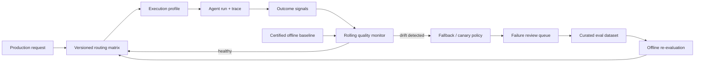

# Routing Drift: Keep Agent Decisions Reliable After Deployment

## Why this matters
Yesterday we turned offline eval results into a routing policy: for each task class, choose the least expensive execution profile that clears its quality and risk gates.

That decision has a shelf life.

A model can change, a system prompt can be edited, a retrieval index can be rebuilt, a tool API can evolve, or the mix of production requests can shift. The router may still send `semantic_repair` work to the same profile even though that profile no longer achieves the reliability measured during certification.

**Routing drift** is the gap between the performance assumed by a routing decision and the performance the profile now delivers.

The architectural lesson is simple: **routing is not a one-time benchmark result; it is a continuously validated control decision.**

## Simple mental model: a circuit breaker with a quality sensor
Think about a service mesh routing traffic to a downstream service. Health checks continuously verify that the destination is still healthy. If failures rise, traffic can be reduced or redirected.

Agent routing needs the equivalent, but HTTP 200 is not enough. An agent can return a perfectly successful HTTP response while choosing the wrong tool, retrieving stale evidence, or producing an incorrect migration.

So add a **quality sensor**:

- **Baseline**: the offline performance that justified the route.
- **Production signal**: observed outcomes from real runs.
- **Drift detector**: compares current behavior with the baseline.
- **Fallback profile**: a previously validated safer execution profile.
- **Re-certification**: reruns offline evals before changing the routing matrix permanently.

## Core components and request flow
1. Version every execution profile: model, prompt, retrieval policy, tool set, and relevant configuration.
2. Route production work using the currently approved routing matrix.
3. Capture traces and outcome signals for each run.
4. Sample representative production runs for evaluation.
5. Compare rolling metrics with the certified baseline and guard thresholds.
6. If degradation is significant, reduce traffic to that profile or fall back to a stronger approved profile.
7. Add new failure examples to a review queue.
8. After human review, promote useful cases into the offline eval dataset.
9. Re-run candidate profiles and publish a new routing-matrix version only after they pass.



## Concrete example: migration automation
Assume your migration agent routes routine Spring Boot code generation to a `standard-v4` profile because offline evaluation showed a 94% pass rate against a 92% requirement.

Two weeks later, a new source-system pattern becomes common: Mule flows using custom DataWeave modules. Production traces show that generated projects compile, but parity tests fail more often.

The router itself is functioning correctly. The **workload distribution has drifted**.

A sensible response is not to let the agent decide that it now needs a stronger model. The harness should detect that the rolling task-completion rate for `generate/custom-dataweave` has crossed its threshold, temporarily route that subclass to the already-approved `deep-v3` profile, collect representative failures, and trigger offline re-evaluation.

This separates two decisions:

- **Runtime protection**: use an already certified fallback.
- **Policy evolution**: change the normal route only after evaluation and approval.

## Practical Python implementation
A minimal monitor can compare a rolling production metric with its certified baseline.

```python
from dataclasses import dataclass
from statistics import mean

@dataclass(frozen=True)
class RouteBaseline:
    task_class: str
    profile: str
    certified_pass_rate: float
    minimum_pass_rate: float
    fallback_profile: str


def routing_health(baseline: RouteBaseline, outcomes: list[bool], min_samples=30):
    if len(outcomes) < min_samples:
        return {"state": "insufficient_data", "profile": baseline.profile}

    observed = mean(outcomes)
    drop = baseline.certified_pass_rate - observed

    if observed < baseline.minimum_pass_rate:
        return {
            "state": "fallback",
            "profile": baseline.fallback_profile,
            "observed_pass_rate": observed,
            "baseline_drop": drop,
        }

    return {
        "state": "healthy",
        "profile": baseline.profile,
        "observed_pass_rate": observed,
        "baseline_drop": drop,
    }
```

This deliberately uses a simple threshold. In production, add confidence intervals, minimum sample sizes, segmentation, and change-point detection before declaring drift. A drop from 94% to 88% over five samples means very little; the same result over 2,000 comparable runs is different.

Most importantly, do not treat every production response as ground truth. Outcome labels should come from reliable signals such as deterministic tests, user corrections, approved human review, or carefully designed graders.

### What should be versioned?
Treat an execution profile as a deployable artifact rather than just a model name:

```text
profile_id: standard-v4
model: <model-version>
system_prompt_sha: 8f2...
retrieval_policy: repo-hybrid-v3
tool_registry_version: 17
skill_bundle_version: migration-2026.09
routing_eval_dataset: migration-routing-v8
certified_pass_rate: 0.94
minimum_pass_rate: 0.92
fallback_profile: deep-v3
```

Without this provenance, you may detect degradation but be unable to explain what changed.

### Java and Go notes
In Java, keep the routing matrix as immutable configuration and publish quality events through your existing telemetry pipeline; Micrometer/OpenTelemetry are natural integration points. In Go, use a small deterministic routing package and keep evaluation asynchronous from the request path. In either language, the LLM should not own the drift detector or fallback decision.

## Offline evals, online signals, and shadow evals
These solve different problems.

**Offline evaluation** runs curated examples before deployment. It answers: *is this profile good enough to approve?*

**Online evaluation** scores sampled production behavior. It answers: *is the approved profile still behaving acceptably on current traffic?*

**Shadow evaluation** runs an alternative profile on sampled requests without letting it create production side effects. It answers: *would another profile now perform better?*

Shadow evaluation is especially useful before changing routes, but tool-using agents require care. Replace write tools with recorded results, read-only replicas, mocks, or sandbox environments. Never replay destructive production actions simply to compare models.

## Common mistakes and failure modes
- **Monitoring only latency and errors.** Agent quality can deteriorate while infrastructure metrics remain green.
- **Using one global success rate.** Drift usually appears first in a task class, tenant, source technology, language, or tool path. Segment metrics.
- **Treating LLM graders as unquestioned truth.** Calibrate graders against human-reviewed examples and combine them with deterministic signals where possible.
- **Automatically learning from every failure.** Production feedback is noisy and can be adversarial. Curate before adding cases to the golden eval set.
- **Changing the route and the profile simultaneously.** You lose causal evidence. Version both independently.
- **Falling back to an untested stronger model.** More capable does not automatically mean safer for a particular workflow. Fallbacks should already be certified.
- **Ignoring retrieval drift.** The model may be unchanged while corpus freshness, chunking, embeddings, filters, or reranking changes the evidence reaching it.
- **No rollback criterion.** Define thresholds and fallback behavior before an incident rather than improvising them afterward.

## Enterprise use cases
**Migration factories:** detect when new integration patterns reduce code-generation or semantic-parity performance.

**Claims agents:** monitor whether document extraction, policy retrieval, or tool-selection quality changes across product lines while preserving approval boundaries for consequential actions.

**Coding assistants:** identify regressions by repository language, framework, or task type after model, prompt, or indexing changes.

**Service-desk agents:** detect when new catalog items or API versions cause tool-selection failures even though conversational quality remains high.

**Agentic RAG:** separately monitor retrieval quality and answer quality so a retrieval regression is not misdiagnosed as a model problem.

## Cloud mapping: where the pieces fit
Cloud services are implementation options, not the architecture itself.

- **AWS:** CloudWatch/OpenTelemetry for operational telemetry; Step Functions or application workflow logic for controlled fallback; Bedrock evaluation capabilities can participate in model/application evaluation where appropriate.
- **Azure:** Azure Monitor/Application Insights with OpenTelemetry for traces and metrics; Azure AI evaluation tooling for evaluation workflows; configuration/versioning can remain in your delivery pipeline.
- **GCP:** Vertex AI Gen AI evaluation supports response and agent evaluation workflows, including detailed evaluation results and traces; Cloud Monitoring/OpenTelemetry can carry runtime signals.

Keep your canonical routing policy and eval dataset portable even if managed evaluation services execute parts of the pipeline.

## A practical architecture rule
Do not build this loop:

`production metric -> LLM decides route -> production`

Build this loop instead:

`production evidence -> deterministic detector -> safe fallback -> curated eval -> re-certification -> versioned route`

That extra separation is what turns continuous evaluation into an engineering control rather than an autonomous self-modification mechanism.

## 30–60 minute design exercise
Take yesterday's three-profile migration router: Economy, Standard, and Deep.

1. Pick three task classes such as inventory, generation, and semantic repair.
2. For each class, write a certified pass rate, minimum acceptable pass rate, and approved fallback.
3. Create a Python function similar to `routing_health()`.
4. Feed it 50 simulated production outcomes where one task class degrades.
5. Make the router fall back only for that class.
6. Add one field that records the prompt, retrieval, or tool-registry version responsible for the run.
7. Write down which failures you would allow into the offline eval dataset automatically and which require human review.

The important result is not the code. It is the boundary between **automatic protection** and **controlled policy change**.

## What to learn next
Next: **evaluating retrieval separately from generation**. When an agentic RAG system gives a wrong answer, you need to determine whether retrieval failed to supply the right evidence, the model misused good evidence, or the agent chose the wrong retrieval strategy.

## Reading
- [OpenAI — Inside our in-house data agent](https://openai.com/index/inside-our-in-house-data-agent/) — a useful production example of systematic evaluation and regression detection.
- [OpenAI — Evals API](https://developers.openai.com/api/reference/java/resources/evals/methods/create) — evaluation objects, datasets, and testing criteria.
- [Google Cloud — Agent evaluation](https://docs.cloud.google.com/gemini-enterprise-agent-platform/models/evaluation-agents-client) — evaluating task completion with detailed results and traces.
- [Google Cloud — Gen AI evaluation overview](https://docs.cloud.google.com/gemini-enterprise-agent-platform/models/evaluation-overview) — evaluation workflows and SDK concepts.
