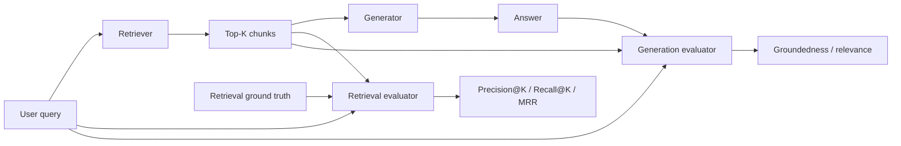

# RAG Failure Attribution: Evaluate Retrieval Before Blaming the Model

## Why this matters
A RAG system has at least two places where quality can fail: **retrieval** can supply the wrong evidence, or **generation** can misuse good evidence. If you measure only the final answer, both failures look identical.

For an architect, this is similar to debugging a distributed request only from the HTTP response. You need measurements at component boundaries.

The key principle is: **evaluate retrieval independently before tuning prompts or changing models.**

## Simple mental model: librarian and analyst
The **retriever** is the librarian: find the right documents and rank useful ones near the top. The **generator** is the analyst: read those documents and answer without inventing unsupported facts.

If the report is wrong, first ask: *Did the librarian provide the right evidence?* Only then ask: *Did the analyst use it correctly?*

## Core terms
- **K**: number of top search results inspected.
- **Precision@K**: fraction of top-K results that are relevant.
- **Recall@K**: fraction of all known relevant documents found in top K.
- **MRR — Mean Reciprocal Rank**: rewards putting the first relevant result near the top.
- **Groundedness**: whether the answer is supported by supplied context.
- **Answer relevance**: whether the answer addresses the user's question.

## Core components and request flow


This creates four useful diagnoses:

1. **Bad retrieval + bad answer** — fix retrieval first.
2. **Good retrieval + bad answer** — investigate prompt, context formatting, model behavior, or reasoning.
3. **Bad retrieval + apparently good answer** — dangerous; the model may be answering from parametric knowledge rather than enterprise evidence.
4. **Good retrieval + good answer** — healthy path.

## Concrete example: migration automation
Suppose an agent migrating a MuleSoft flow to Spring Boot asks the knowledge layer: *What is our approved retry policy for outbound payment APIs?*

The correct standard is `payment-resilience-v3.md`. Retrieval returns:

```text
1. generic-http-retries.md          relevant=False
2. payment-resilience-v2.md         relevant=False
3. payment-resilience-v3.md         relevant=True
4. kafka-retry-guideline.md         relevant=False
5. payment-api-overview.md          relevant=True
```

The evidence is technically present but ranked third and surrounded by plausible distractions. A capable LLM might still answer correctly, masking weak retrieval.

In migration automation, retrieval quality controls which standards, source semantics, templates, and historical decisions enter the agent's working context.

## Practical Python implementation
Start with deterministic metrics before adding an LLM judge.

```python
from dataclasses import dataclass

@dataclass
class RetrievedDoc:
    doc_id: str
    relevant: bool


def precision_at_k(results: list[RetrievedDoc], k: int) -> float:
    top_k = results[:k]
    return sum(d.relevant for d in top_k) / k


def recall_at_k(results: list[RetrievedDoc], relevant_doc_ids: set[str], k: int) -> float:
    retrieved = {d.doc_id for d in results[:k]}
    return len(retrieved & relevant_doc_ids) / len(relevant_doc_ids)


def reciprocal_rank(results: list[RetrievedDoc]) -> float:
    for rank, doc in enumerate(results, start=1):
        if doc.relevant:
            return 1.0 / rank
    return 0.0
```

Run these across a **retrieval eval set**: representative queries with human-reviewed relevant document IDs. Fifty to one hundred carefully chosen queries covering important failure modes can reveal more than a large synthetic set with weak labels.

### Evaluate generation separately
Keep both metric groups on the same trace:

```python
{
    "query": query,
    "retrieved_doc_ids": [...],
    "retrieval_metrics": {
        "precision_at_5": 0.6,
        "recall_at_5": 1.0,
        "mrr": 0.5,
    },
    "answer": answer,
    "generation_metrics": {
        "groundedness": 0.96,
        "answer_relevance": 0.91,
    },
}
```

This lets you correlate downstream answer failures with upstream retrieval behavior.

## Agentic RAG adds one more layer
In basic RAG, retrieval strategy is usually fixed. In **agentic RAG**, the agent may decide whether to search, rewrite a query, select a corpus, apply filters, retrieve again, or use another tool.

Evaluate three layers separately:

- **Retrieval decision** — did the agent choose the right source and search strategy?
- **Retrieval result** — did that strategy return the right evidence?
- **Evidence use** — did generation correctly use the evidence?

Do not collapse these into one "RAG score." A single score is useful for dashboards but weak for debugging.

## Common mistakes and failure modes
- Measuring only final-answer accuracy and changing the LLM when retrieval is the real problem.
- Using only precision; enterprise questions often require multiple documents, making recall important.
- Increasing `top_k` until recall improves, flooding context with irrelevant chunks.
- Treating chunks as the only evaluation unit when ground truth is a document, policy section, API specification, or code symbol.
- Letting an LLM judge define ground truth for critical datasets without human review.
- Evaluating only easy positive queries rather than queries for which the corpus intentionally has no answer.

## Enterprise use cases
The decomposition is useful for policy assistants, claims knowledge systems, coding assistants, incident diagnosis, architecture knowledge retrieval, and modernization agents. A fluent answer based on the wrong source can be more dangerous than an explicit failure.

For migration automation, maintain retrieval eval sets by knowledge domain: source-platform semantics, target architecture standards, transformation recipes, security policies, and project-specific decisions.

## Practical implementation guidance
Instrument retrieval as a first-class span. Capture query or privacy-safe representation, query rewrite, filters, corpus/index version, retrieval strategy, top-K IDs and scores, reranker version, latency, and final chunks passed to the model.

Version retrieval configuration exactly like prompts and models. A new embedding model, chunking strategy, hybrid-search weight, metadata filter, or reranker can change behavior without application-code changes.

For **Java**, keep evaluation outside Spring AI/LangChain4j abstractions where possible: export ranked document IDs and score them with deterministic test utilities. For **Go**, make the retriever return a typed ranked result so evaluation does not depend on parsing prompts.

## Cloud mappings
- **Azure**: Azure AI Search plus Microsoft Foundry RAG evaluators. Microsoft's architecture guidance describes Precision@K, Recall@K, and MRR for retrieval evaluation.
- **GCP**: Vertex AI RAG Engine provides managed retrieval and configurable retrieval/ranking; retain evidence and evaluate it independently from generation.
- **AWS**: with Bedrock Knowledge Bases or custom OpenSearch retrieval, capture ranked source IDs before invoking the model and run the same provider-neutral metrics.

The metrics should belong to your evaluation architecture, not to a cloud SDK.

## 30–60 minute exercise
Take 10 realistic questions from one knowledge domain. For each, manually identify one to three documents that should contain the answer.

Run your current retrieval mechanism with `K=5`, calculate Precision@5, Recall@5, and reciprocal rank, then inspect the two weakest queries. Determine whether the issue comes from chunking, query wording, metadata filtering, embeddings, or ranking.

Do **not** change the LLM. The goal is to make retrieval observable independently of generation.

## What to learn next
Next: **retrieval strategy evaluation** — comparing vector search, keyword/BM25, hybrid search, metadata filtering, reranking, and query rewriting without choosing a technique by intuition.

## Reading
1. [Microsoft Azure Architecture Center — RAG information retrieval and evaluation](https://learn.microsoft.com/azure/architecture/ai-ml/guide/rag/rag-information-retrieval)
2. [Microsoft Foundry — RAG evaluators](https://learn.microsoft.com/en-us/azure/foundry/concepts/evaluation-evaluators/rag-evaluators)
3. [Google Cloud — Vertex AI RAG quickstart](https://docs.cloud.google.com/vertex-ai/generative-ai/docs/samples/generativeaionvertexai-rag-quickstart)
4. [Google Cloud — RAG retrieval query sample](https://docs.cloud.google.com/vertex-ai/generative-ai/docs/samples/generativeaionvertexai-rag-retrieval-query)
