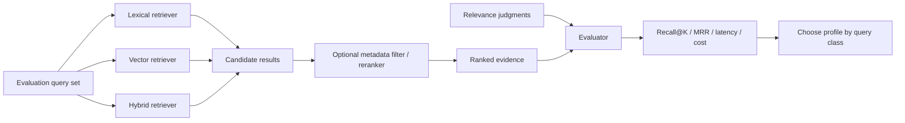

# Retrieval Strategy Evaluation: Choose Search with Evidence, Not Intuition

## Why this matters
Yesterday we separated retrieval quality from generation quality. The next question is practical: **which retrieval strategy should your system use?**

Teams often select vector search because RAG is associated with embeddings. That is too simplistic. Exact identifiers, product codes, API names, error messages, and policy clauses often favor lexical search. Natural-language paraphrases favor semantic/vector retrieval. Enterprise queries commonly need both.

The architectural rule is: **treat retrieval strategy as an evaluated component, not a fixed implementation choice.**

## Simple mental model: several librarians, one exam
Imagine three librarians answering the same questions:
- **Lexical/BM25** librarian matches important words.
- **Vector** librarian matches meaning even when wording differs.
- **Hybrid** librarian asks both and combines their ranked lists.

A **reranker** is a senior librarian who receives a shortlist and reorders it using a more expensive relevance model.

Do not ask which librarian is theoretically smartest. Give all of them the same exam and measure who retrieves the required evidence reliably enough for your workload.

## Core terms
- **Lexical search**: retrieves documents using words and term statistics; BM25 is a common ranking algorithm.
- **Vector search**: embeds query and documents as numeric vectors and retrieves nearby vectors by semantic similarity.
- **Hybrid search**: runs lexical and vector retrieval together and fuses their ranked results.
- **RRF (Reciprocal Rank Fusion)**: combines ranked lists using rank position rather than directly comparing incompatible raw scores.
- **Metadata filtering**: restricts candidates using structured attributes such as tenant, product, jurisdiction, version, or document type.
- **Reranking**: applies a stronger relevance model to a small candidate set after initial retrieval.
- **Query rewriting**: transforms the user's query into a form that may retrieve better evidence.

## Core components and request flow


The important boundary is before generation. Keep the LLM answer generator out of this experiment so retrieval differences are measurable directly.

## Concrete example: migration assistant
Suppose an agent helps migrate MuleSoft integrations to Spring Boot. Your evaluation set contains queries such as:

1. `Where is customer-sync-v2 implemented?` — exact identifier.
2. `Which flows retry failed outbound calls?` — semantic intent.
3. `Find Salesforce integrations for policy events in production.` — semantic intent plus metadata constraints.

Create relevance judgments listing the chunks that should be retrieved for each query. Then execute several retrieval profiles against exactly the same dataset.

```python
from dataclasses import dataclass

@dataclass
class RetrievalProfile:
    name: str
    lexical: bool
    vector: bool
    rerank: bool = False
    top_k: int = 10

profiles = [
    RetrievalProfile("bm25", True, False),
    RetrievalProfile("vector", False, True),
    RetrievalProfile("hybrid", True, True),
    RetrievalProfile("hybrid_rerank", True, True, rerank=True),
]

def reciprocal_rank_fusion(rankings, k=60):
    scores = {}
    for ranking in rankings:
        for rank, doc_id in enumerate(ranking, start=1):
            scores[doc_id] = scores.get(doc_id, 0) + 1 / (k + rank)
    return sorted(scores, key=scores.get, reverse=True)

def recall_at_k(results, relevant, k):
    return len(set(results[:k]) & set(relevant)) / max(len(relevant), 1)

def reciprocal_rank(results, relevant):
    relevant = set(relevant)
    for rank, doc_id in enumerate(results, start=1):
        if doc_id in relevant:
            return 1 / rank
    return 0.0
```

Your harness should record, per query and profile: retrieved document IDs, Recall@K, reciprocal rank, latency, and retrieval cost. Aggregate results by **query class**, not only globally.

Why? A global winner can hide important behavior. Hybrid retrieval may win overall while BM25 is both cheaper and more accurate for identifier-heavy queries.

## A practical evaluation table

| Profile | Identifier queries | Natural-language queries | Filtered queries | Cost/latency |
|---|---|---|---|---|
| BM25 | Often strong | Variable | Strong with filters | Low |
| Vector | Can miss exact tokens | Often strong | Depends on filter support | Medium |
| Hybrid | Strong general baseline | Strong | Strong | Medium |
| Hybrid + rerank | Usually strongest when shortlist contains evidence | Strong | Strong | Higher |

These are hypotheses, not universal results. Your evaluation dataset decides.

## Metadata filtering: retrieval or security?
Both, but do not confuse them. Filtering by `product=life` can improve relevance. Filtering by `tenant_id` or ACL can enforce an access boundary. **Security filters must be deterministic and applied before evidence reaches the model.** Do not ask an LLM to remove unauthorized chunks after retrieval.

## Reranking: spend intelligence after recall
A useful architecture is two-stage retrieval:

1. **Candidate generation** optimizes recall and cheaply finds perhaps 30-100 candidates.
2. **Reranking** spends more computation to reorder that shortlist and returns perhaps 5-10 chunks to the model.

This separates two objectives: *find the evidence somewhere in the candidate set* and *place the best evidence near the top*.

## Common mistakes and failure modes
- **Testing only final answers.** You cannot tell whether search or generation improved.
- **Assuming vector means better.** Exact names, codes, stack traces, and rare terms frequently need lexical matching.
- **Changing several variables together.** Changing chunking, embeddings, K, reranking, and prompt simultaneously makes results uninterpretable.
- **Optimizing only Recall@K.** Retrieving 100 chunks may improve recall while increasing latency, token usage, distraction, and cost.
- **Using one aggregate score.** Segment by query class: identifiers, semantic questions, multi-hop questions, filtered queries, and ambiguous queries.
- **Reranking too early.** A reranker cannot recover a relevant document that candidate retrieval never found.
- **Treating ACL filtering as optional relevance tuning.** Authorization constraints belong in the deterministic retrieval boundary.

## Enterprise use cases
- **Insurance claims:** lexical matching for claim codes and policy clauses; semantic retrieval for adjuster questions; ACL/jurisdiction filters before reranking.
- **Application modernization:** exact search for flow/API names plus vector retrieval for behavioral equivalence and migration guidance.
- **Developer assistants:** lexical retrieval for symbols and error strings; semantic retrieval for architecture questions; reranking for repository-scale context selection.
- **Operations:** keyword search for error codes combined with semantic retrieval of incident reports and runbooks.

## Practical implementation guidance
Start with three profiles: BM25, vector, and hybrid. Freeze the corpus, chunking, evaluation queries, relevance judgments, and `top_k`. Change only retrieval strategy. Then add reranking as a second experiment.

For Python, keep a small provider-neutral evaluation interface:

```python
class Retriever:
    def search(self, query: str, filters: dict, k: int) -> list[str]:
        """Return ranked document IDs."""
        raise NotImplementedError

def evaluate(retriever, cases, k=10):
    rows = []
    for case in cases:
        results = retriever.search(case["query"], case.get("filters", {}), k)
        rows.append({
            "query_class": case["class"],
            "recall": recall_at_k(results, case["relevant"], k),
            "rr": reciprocal_rank(results, case["relevant"]),
        })
    return rows
```

Persist the ranked document IDs as well as metrics. They make regressions explainable.

**Java:** expose retrieval profiles behind a small strategy interface and run the same JUnit parameterized dataset through each implementation. **Go:** use a `Retriever` interface and table-driven tests; keep evaluation logic independent of the search vendor.

## Cloud mappings
- **Azure AI Search:** supports lexical, vector, hybrid queries, RRF fusion, filters, and semantic reranking. This makes it convenient for controlled side-by-side experiments.
- **AWS:** OpenSearch Service supports lexical/vector retrieval patterns; Bedrock Knowledge Bases can provide managed retrieval for RAG workloads.
- **GCP:** Vertex AI Search and Vector Search cover managed search and vector retrieval patterns. Preserve your own evaluation dataset even when using managed retrieval.

The service is replaceable; your **evaluation contract** should not be.

## 30-60 minute hands-on exercise
Build a tiny retrieval benchmark with 10-15 documents from one repository or architecture knowledge base.

1. Write 8 queries: three exact identifier queries, three semantic questions, and two queries requiring metadata filters.
2. For each query, manually record one or more relevant document IDs.
3. Implement or mock two ranked result sets: lexical and vector.
4. Add the RRF function above to create a hybrid ranking.
5. Calculate Recall@5 and reciprocal rank for all three profiles.
6. Group results by query class and write a one-paragraph routing recommendation.

The goal is not to build production search. It is to experience the discipline of choosing retrieval from evidence.

## What to learn next
Next, move from **one retrieval strategy for every request** to **query-aware retrieval routing**: classify the information need, choose lexical/vector/hybrid/search tools deliberately, and evaluate whether the router itself makes good decisions.

## Reading
1. Microsoft — Create a hybrid query in Azure AI Search: https://learn.microsoft.com/en-us/azure/search/hybrid-search-how-to-query
2. Microsoft — Hybrid search scoring with Reciprocal Rank Fusion: https://learn.microsoft.com/en-us/azure/search/hybrid-search-ranking
3. Microsoft — Configure semantic ranker: https://learn.microsoft.com/en-us/azure/search/semantic-how-to-configure
4. Elastic — What is hybrid search?: https://www.elastic.co/what-is/hybrid-search

---

**Architect's takeaway:** retrieval is an execution profile with measurable quality, latency, and cost. Build a relevance dataset first; then let evidence determine whether lexical, vector, hybrid, filtering, or reranking belongs in each query path.