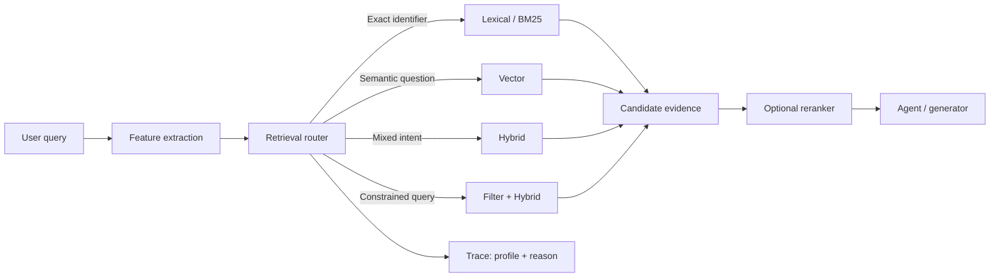

# Query-Aware Retrieval Routing: Let the Query Choose the Search Strategy

## Why this matters
Yesterday we evaluated lexical, vector, hybrid, filtered, and reranked retrieval as competing strategies. The next step is to avoid using one winner for every query.

Enterprise queries differ. `ERR-1042` is an exact token. “How do I migrate an integration that retries after a downstream timeout?” is semantic. “Cancellation rules for product X in Germany” needs both semantic relevance and metadata constraints.

The architectural idea is simple: **put a small retrieval router before the retrievers, then evaluate the router independently.**

## Simple mental model: a hospital reception desk
A hospital does not send every patient to the same specialist. Reception first identifies the kind of need, then routes it. Retrieval can work the same way.

The **router** does not answer the question. It selects an appropriate retrieval profile. A **retrieval profile** is a named configuration such as lexical search, vector search, hybrid search, or hybrid search plus mandatory filters and reranking.

## Core terms
- **Query intent**: retrieval characteristics such as exact identifier lookup, semantic question, or constrained domain query.
- **Retrieval router**: logic that selects a retrieval profile.
- **Retrieval profile**: a versioned combination of search method, filters, candidate count, and optional reranker.
- **Fallback**: a safe default profile when routing confidence is low.
- **Router accuracy**: how often the router chooses a profile that meets the retrieval target.

## Core components and request flow


The router should normally be cheap and deterministic where possible. Regexes, metadata presence, query length, identifier patterns, and domain rules can handle many cases. Use an LLM classifier only when intent cannot be reliably inferred from simple features.

## Concrete implementation example: migration knowledge assistant
Suppose an engineering assistant searches migration documentation containing API names, Mule flow identifiers, error codes, architectural guidance, and product-specific rules.

```python
from dataclasses import dataclass
import re

@dataclass(frozen=True)
class RetrievalPlan:
    profile: str
    reason: str

ID_PATTERN = re.compile(r"\b(?:ERR-\d+|[A-Z][A-Z0-9_-]{3,})\b")

def route(query: str, metadata: dict) -> RetrievalPlan:
    exact = bool(ID_PATTERN.search(query))
    constrained = any(metadata.get(k) for k in ("product", "country", "version"))
    if exact and not constrained:
        return RetrievalPlan("lexical", "exact identifier detected")
    if constrained:
        return RetrievalPlan("filtered_hybrid", "structured constraints present")
    if len(query.split()) >= 8:
        return RetrievalPlan("hybrid", "natural-language semantic query")
    return RetrievalPlan("hybrid", "safe default")
```

The router chooses only pre-approved profiles:

```python
PROFILES = {
    "lexical": {"mode": "bm25", "top_k": 10},
    "hybrid": {"mode": "hybrid", "top_k": 20, "rerank_top": 8},
    "filtered_hybrid": {"mode": "hybrid", "top_k": 20,
                        "require_metadata_filter": True, "rerank_top": 8},
}
```

Azure AI Search provides a concrete implementation reference: keyword and vector queries can execute in parallel, merge with Reciprocal Rank Fusion (RRF), and optionally undergo semantic reranking.

## Evaluate the router separately
Build a labelled dataset:

```python
cases = [
    ("Explain retry behavior after timeout", {}, "hybrid"),
    ("ERR-1042", {}, "lexical"),
    ("Cancellation policy", {"country": "DE"}, "filtered_hybrid"),
]

accuracy = sum(route(q, m).profile == expected
               for q, m, expected in cases) / len(cases)
print(f"router_accuracy={accuracy:.2%}")
```

Then measure the more important outcome: Recall@K or MRR produced by the chosen profile versus an oracle that tries all profiles. Router label accuracy is secondary to evidence quality.

## Common mistakes and failure modes
- Using an LLM for every routing decision, adding latency, cost, and nondeterminism.
- Routing without a well-evaluated fallback.
- Letting the router invent arbitrary retrieval parameters instead of choosing versioned profiles.
- Treating tenant, entitlement, jurisdiction, or ACL filters as optional relevance hints rather than security boundaries.
- Measuring only final answer quality instead of tracing `query → profile → retrieved IDs → answer`.
- Optimizing router accuracy rather than end-to-end evidence quality, latency, and cost.

## Enterprise use cases
- **Migration automation:** exact flow/API identifiers use lexical search; transformation questions use hybrid retrieval; product/version constraints become filters.
- **Claims assistants:** policy numbers and codes favor exact search while coverage questions need semantic retrieval plus product/jurisdiction filters.
- **Developer assistants:** stack traces and symbols favor lexical retrieval; architectural questions favor semantic/hybrid retrieval.
- **Operations copilots:** incident IDs need exact lookup while symptom descriptions need semantic retrieval across runbooks and prior incidents.

## Practical architecture guidance
Start with two or three profiles, not ten. Make hybrid your evaluated fallback. Keep authorization filtering outside model discretion. Version the router and profile registry together and log the route reason in the agent trace.

Only introduce an LLM router after rule-based routing reaches a measurable limitation. Constrain its output to a closed schema such as `Literal["lexical", "vector", "hybrid", "filtered_hybrid"]` and retain deterministic validation.

For Java, model profiles as enums or sealed types and keep routing stateless. For Go, use typed string constants plus a validated configuration map. The principle is identical: **routing chooses policy-approved retrieval behavior; it does not directly execute arbitrary search.**

## Cloud mappings
- **AWS:** Amazon Bedrock Knowledge Bases supports semantic and hybrid retrieval for supported vector stores; default mode can choose the strategy.
- **Azure:** Azure AI Search supports keyword, vector, hybrid/RRF, filtering, and semantic reranking.
- **GCP:** place the same routing layer above the managed retrieval/search service and keep routing policy in the application or harness.

## 30–60 minute exercise
Take 20 queries from a system you know. Label each `lexical`, `hybrid`, or `filtered_hybrid`. Implement the deterministic router above and record expected profile, selected profile, reason, Recall@5, and latency. Then compare it with simply using hybrid for all 20 queries. **Routing is useful only when measured benefit exceeds its complexity.**

## What to learn next
Next: **query rewriting and decomposition**—when the original user query is not the best retrieval query, and how an agent can rewrite or split it without silently changing intent.

## Reading
1. [Azure AI Search: Create a hybrid query](https://learn.microsoft.com/en-us/azure/search/hybrid-search-how-to-query)
2. [Azure AI Search: Hybrid search ranking with RRF](https://learn.microsoft.com/en-us/azure/search/hybrid-search-ranking)
3. [Amazon Bedrock Knowledge Bases: Configure search type](https://docs.aws.amazon.com/bedrock/latest/userguide/kb-test-config.html)
4. [Amazon Bedrock Knowledge Bases: Retrieve data and rerank](https://docs.aws.amazon.com/bedrock/latest/userguide/kb-test-retrieve.html)
