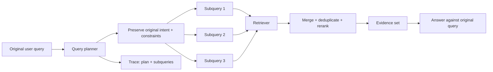

# Query Rewriting and Decomposition: Search for What the User Really Needs

## Why this matters
Yesterday we routed queries to different retrieval strategies. But even the right retriever can fail when the input query is badly shaped for search.

A user might ask: **“For the old payment flows, what changed in retry and security, and what should we migrate first?”** That is really several information needs. Sending it unchanged to one vector search can retrieve documents about only one part.

The next layer of agentic RAG is **query transformation**: improve the search request before retrieval without changing what the user asked.

## Simple mental model: turn a meeting request into work tickets
A stakeholder says, “Fix checkout reliability and security.” An architect does not hand that sentence directly to three teams. You preserve the objective, clarify terminology, and split the work into focused tasks.

Retrieval should behave similarly:
- **Query rewriting** restates one information need in search-friendly language.
- **Query decomposition** splits a compound information need into independently searchable subqueries.

The original query remains the source of truth.

## Core terms
- **Rewrite:** an alternate formulation of the same information need.
- **Decomposition:** splitting a multi-part question into smaller subqueries.
- **Query planner:** logic or a model that decides whether to keep, rewrite, or decompose a query.
- **Intent preservation:** ensuring transformed queries do not add, remove, or alter user constraints.
- **Fan-out:** executing several subqueries, often in parallel.
- **Merge:** combining and deduplicating retrieved evidence before generation.

## Core components and request flow


The important boundary is that transformation improves **retrieval**, while final answer generation still answers the **original** question.

## Concrete example: migration knowledge assistant
Suppose the user asks:

> For Mule payment flows using Salesforce, what retry behavior and authentication must change when migrating to Spring Boot?

A useful decomposition is:
1. `Mule payment flow retry error handling configuration`
2. `Mule Salesforce connector authentication payment flows`
3. `Spring Boot retry patterns Salesforce integration`
4. `Spring Boot OAuth authentication Salesforce integration`

Notice what did **not** happen: the planner did not invent a target retry count, OAuth grant, product version, or security policy.

A simple Python representation:

```python
from dataclasses import dataclass

@dataclass(frozen=True)
class QueryPlan:
    original: str
    subqueries: tuple[str, ...]

MAX_SUBQUERIES = 4

def validate(plan: QueryPlan) -> QueryPlan:
    if not plan.subqueries:
        return QueryPlan(plan.original, (plan.original,))
    cleaned = tuple(dict.fromkeys(q.strip() for q in plan.subqueries if q.strip()))
    return QueryPlan(plan.original, cleaned[:MAX_SUBQUERIES])

async def retrieve_plan(plan: QueryPlan, search):
    # execute concurrently in production
    result_sets = [await search(q) for q in plan.subqueries]
    return deduplicate_and_rerank(result_sets, original_query=plan.original)
```

For an LLM planner, constrain output to a schema rather than accepting prose:

```json
{
  "action": "decompose",
  "subqueries": [
    "Mule payment flow retry error handling configuration",
    "Mule Salesforce connector authentication payment flows",
    "Spring Boot retry patterns Salesforce integration",
    "Spring Boot OAuth authentication Salesforce integration"
  ]
}
```

Then validate count, length, allowed sources, tenant filters, and mandatory metadata before execution.

## Rewrite or decompose?
Use a **rewrite** when there is one information need but the wording is weak: spelling errors, conversational phrasing, acronyms, or synonyms. Use **decomposition** when the answer requires evidence for multiple facts, comparisons, entities, time periods, or constraints.

Do neither when an exact identifier such as `ERR-1042`, API name, policy number, or code symbol should be searched literally. Transformation is a tool, not a mandatory stage.

## Evaluate the transformation
Do not score a rewrite because it “looks better.” Compare retrieval outcomes against the original query.

For each test case record:
- Recall@K before and after transformation
- MRR or rank of the first relevant result
- number of subqueries
- retrieval latency and cost
- intent-preservation failures
- final grounded-answer quality

A planner is useful only when the additional retrieval quality justifies its extra model call, searches, and latency.

## Common mistakes and failure modes
- Rewriting exact identifiers and destroying lexical matches.
- Allowing the planner to invent constraints not present in the original request.
- Generating too many subqueries and creating uncontrolled retrieval fan-out.
- Applying authorization filters after decomposition instead of to every subquery.
- Concatenating all results into context without deduplication and reranking.
- Answering the transformed query instead of the original user question.
- Evaluating only final answer quality, making retrieval-planning regressions hard to diagnose.

## Enterprise use cases
- **Migration automation:** split source behavior, target pattern, security, and compatibility questions before searching code and architecture knowledge.
- **Claims:** decompose coverage, exclusions, jurisdiction, and claim-history evidence while preserving entitlement filters.
- **Developer assistants:** turn “why did deployment fail and how did we fix this before?” into log/error lookup plus prior-incident retrieval.
- **Operations:** separate symptoms, affected component, recent changes, and runbook procedures.

## Practical architecture guidance
Start with deterministic detection of compound queries and exact identifiers. Add an LLM planner only for genuinely ambiguous or multi-part questions. Keep the planner's output closed and typed, cap fan-out, and log `original_query → plan → subqueries → document IDs`.

Treat security filters as inherited execution context: tenant, ACL, jurisdiction, environment, and data-classification constraints must be attached to **every** generated subquery and must never be delegated to the model.

For Java, represent the plan with a record and an enum such as `KEEP`, `REWRITE`, `DECOMPOSE`. In Go, use a struct with validated `[]string` subqueries and enforce the fan-out cap before launching goroutines.

## Cloud mappings
- **AWS:** Amazon Bedrock Knowledge Bases supports query decomposition, and agentic retrieval can decompose complex questions, retrieve iteratively, and evaluate whether evidence is sufficient.
- **Azure:** Azure AI Search agentic retrieval uses LLM query planning to decompose complex questions, runs focused subqueries in parallel, reranks them, and merges results.
- **GCP:** Vertex AI RAG Engine supplies managed retrieval primitives; query planning/decomposition can remain an application or agent-harness responsibility when you need explicit control.

## 30–60 minute exercise
Take 15 real architecture or migration questions. Mark each as `KEEP`, `REWRITE`, or `DECOMPOSE`. For decomposed questions, write no more than four subqueries. Run both the original and transformed versions against the same corpus and compare Recall@5, first-relevant rank, latency, and total retrieved chunks. Inspect every case where transformation made retrieval worse.

The goal is not to maximize decomposition. It is to learn **when transformation earns its cost**.

## What to learn next
Next: **multi-hop retrieval and sufficiency checking**—after the first retrieval, how an agent decides whether it has enough evidence or must search again using what it just learned.

## Reading
1. [Azure AI Search — Agentic retrieval overview](https://learn.microsoft.com/en-us/azure/search/agentic-retrieval-overview)
2. [Azure AI Search — Agentic retrieval quickstart](https://learn.microsoft.com/en-us/azure/search/search-get-started-agentic-retrieval)
3. [Amazon Bedrock — Agentic retrieval](https://docs.aws.amazon.com/bedrock/latest/userguide/kb-test-agentic-retrieve.html)
4. [Amazon Bedrock — Configure queries and query decomposition](https://docs.aws.amazon.com/bedrock/latest/userguide/kb-test-config.html)
5. [Anthropic — Contextual Retrieval](https://www.anthropic.com/engineering/contextual-retrieval)
