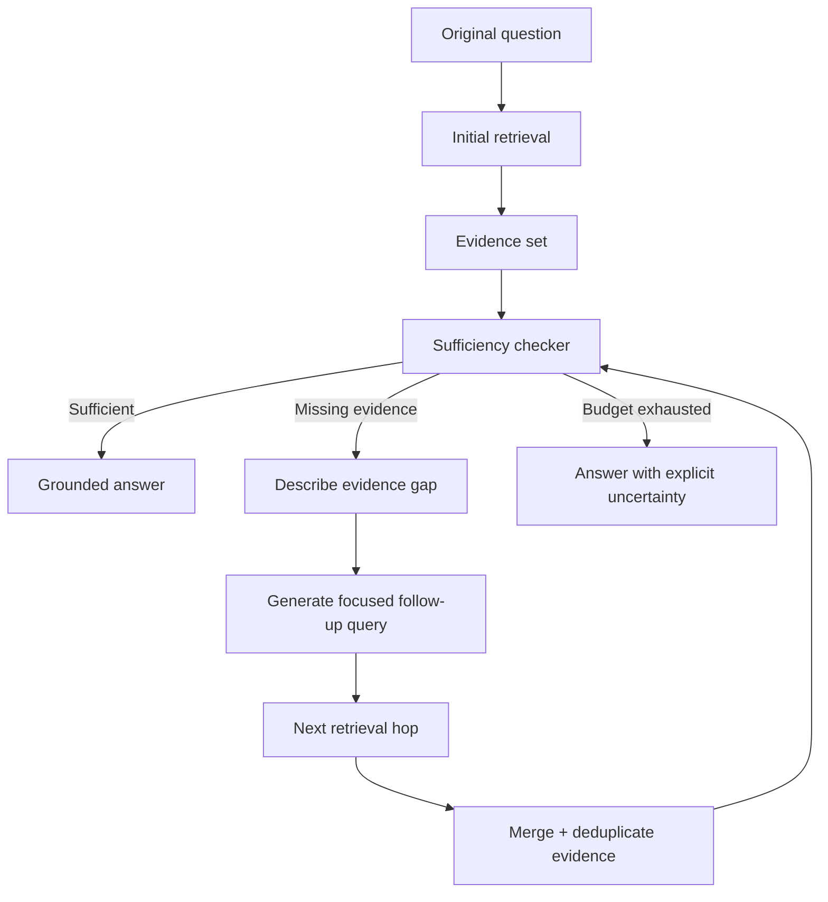

# Multi-Hop Retrieval and Sufficiency Checking: Know When to Search Again

## Why this matters
Yesterday we improved retrieval by rewriting and decomposing the user's query. The next problem appears after retrieval: **how does the agent know whether it has enough evidence to answer?**

A normal RAG pipeline often retrieves once and generates. That works for questions whose answer is contained in one well-matched document. Enterprise questions frequently require facts that live in different documents or depend on each other.

**Multi-hop retrieval** means performing another retrieval step because evidence from an earlier step revealed a specific missing fact. **Sufficiency checking** is the decision gate that determines whether another hop is justified.

## Simple mental model: an architect investigating an incident
Suppose you are investigating why an API failed after a deployment. You first read the incident ticket. It says the failure began after a certificate rotation. You now know the next useful question: *Which certificate version was deployed to this environment?*

You do not search everything again. You search specifically for the missing evidence.

**retrieve → inspect evidence → identify a gap → retrieve for that gap → stop when sufficient**.

The key architectural point is that **multi-hop does not mean unlimited searching**. It is a bounded evidence-gathering loop.

## Core terms
- **Retrieval hop:** one round of search against one or more knowledge sources.
- **Evidence set:** the chunks or records collected so far.
- **Sufficiency:** whether the evidence set supports all material parts of the original question.
- **Evidence gap:** a specific fact or relationship still required to answer.
- **Follow-up query:** a query generated specifically to close an evidence gap.
- **Stop condition:** a deterministic rule that prevents unnecessary or endless retrieval.

## Core components and request flow


A practical flow is:
1. Preserve the original question and constraints.
2. Perform the first retrieval using the strategy selected by your retrieval router.
3. Evaluate evidence coverage against the original question.
4. If sufficient, generate the answer.
5. If insufficient, describe the missing evidence explicitly.
6. Create a focused query for that gap rather than repeating the original query.
7. Retrieve again, merge evidence, and recheck sufficiency.
8. Stop after a small hop budget and expose uncertainty if evidence is still incomplete.

## Concrete example: middleware migration analysis
Assume an agent must answer:

> "Can we migrate the payment retry flow from MuleSoft to Spring Boot without changing its failure semantics?"

The first retrieval finds the Mule flow definition and shows three retries with exponential backoff. That is useful but insufficient: equivalence also depends on what happens after retries are exhausted.

The sufficiency checker produces a structured gap:
```json
{
  "sufficient": false,
  "missing": ["dead-letter or terminal failure behavior after retry exhaustion"],
  "next_query": "payment retry exhausted terminal failure DLQ error handler"
}
```

The second hop finds an operations runbook stating that exhausted messages are written to a JMS dead-letter queue and an alert is raised. The evidence set now covers retry policy **and** terminal failure behavior. The agent can produce a migration recommendation grounded in both sources.

Notice what made the second hop useful: the first retrieval created information that made the next search more precise.

## Practical Python implementation
Keep the loop in the **agent harness**, not hidden inside a prompt. The model can assess evidence and propose the next query, but deterministic code owns budgets and stopping.

```python
from dataclasses import dataclass
from typing import Callable

@dataclass
class Sufficiency:
    sufficient: bool
    missing: list[str]
    next_query: str | None = None

@dataclass
class RetrievalState:
    question: str
    evidence: list[dict]
    hops: int = 0


def multi_hop_retrieve(
    question: str,
    retrieve: Callable[[str], list[dict]],
    check_sufficiency: Callable[[str, list[dict]], Sufficiency],
    max_hops: int = 3,
) -> RetrievalState:
    state = RetrievalState(question=question, evidence=[])
    query = question

    while state.hops < max_hops:
        results = retrieve(query)
        state.evidence = deduplicate(state.evidence + results)
        state.hops += 1

        check = check_sufficiency(question, state.evidence)
        if check.sufficient:
            return state

        if not check.next_query:
            break

        query = check.next_query

    return state


def deduplicate(items: list[dict]) -> list[dict]:
    seen = set()
    output = []
    for item in items:
        key = item["id"]
        if key not in seen:
            seen.add(key)
            output.append(item)
    return output
```

The `check_sufficiency` implementation can use an LLM with a strict structured-output schema. Ask it to judge **coverage**, not to answer the question. For higher-risk workflows, combine model judgment with deterministic requirements—for example, a migration parity assessment may require evidence for happy path, error path, retries, transactions, security, and external side effects.

A useful output contract is:
```json
{
  "sufficient": true,
  "covered_requirements": ["retry policy", "terminal failure behavior"],
  "missing_requirements": [],
  "next_query": null
}
```

In Java, represent this contract as a record and keep the loop in an application service. In Go, use a typed struct and `context.Context` so hop-level deadlines and cancellation propagate to retrievers.

## Where the boundary should sit
There are two tempting extremes:

**Single-pass RAG:** always retrieve once. It is fast and predictable but fails when evidence is distributed.

**Free-running agent:** allow the model to search repeatedly until it feels finished. It can solve harder questions but creates latency, cost, and loop risks.

For enterprise systems, prefer a **bounded retrieval loop**:
- maximum hops, usually 2–4;
- maximum retrieved chunks;
- time and token budgets;
- explicit evidence gaps;
- duplicate-query detection;
- minimum relevance threshold;
- an uncertainty path when the budget expires.

This makes the behavior observable and testable.

## Common mistakes and failure modes
- **Using answer confidence as sufficiency.** A fluent model can be confident with incomplete evidence. Check coverage of required facts instead.
- **Repeating the same query.** Each additional hop should target a newly identified gap.
- **No hop budget.** Retrieval loops can consume latency and money without materially improving evidence.
- **Letting new evidence change the original objective.** Follow-up queries should close gaps in the original question, not expand scope indefinitely.
- **Ignoring contradictory evidence.** Sufficiency is not just quantity. Conflicting sources should trigger reconciliation or explicit uncertainty.
- **Passing every retrieved chunk to generation.** Merge, deduplicate, rerank, and retain only useful evidence.
- **Hiding the loop inside an agent framework.** You still need traces showing each query, evidence, sufficiency decision, and stop reason.

## Enterprise use cases
**Application migration:** retrieve implementation semantics, then follow dependencies such as shared error handlers, transaction policies, schemas, and operational runbooks.

**Claims case management:** retrieve the claim, then policy clauses, endorsements, prior correspondence, or jurisdiction-specific rules only when needed.

**Production incident analysis:** use logs to identify a dependency, then retrieve deployment history, configuration, or change records for that dependency.

**Security investigation:** retrieve an alert, then identity events and resource activity required to establish the sequence of actions.

**Architecture knowledge assistants:** follow references between ADRs, service catalogs, API contracts, and operational documentation rather than hoping one search returns everything.

## Cloud mappings
- **AWS:** Amazon Bedrock Knowledge Bases documents agentic retrieval that decomposes complex queries, iteratively retrieves, and evaluates whether results are sufficient. Keep application-level budgets even when using a managed retrieval loop.
- **Azure:** Azure AI Search agentic retrieval supports query planning, focused subqueries, parallel retrieval, reranking, and unified results. Retrieval reasoning effort controls how much LLM-based planning is used.
- **GCP:** Vertex AI RAG Engine provides managed retrieval primitives. If you need explicit sufficiency-driven hops, orchestrate the loop in your agent or application layer and keep the RAG Engine as the retriever.

## Implementation guidance for architects
Treat retrieval as a subsystem with a contract, not as an opaque tool call. Record per hop:
- original question;
- generated query;
- retrieval strategy and knowledge source;
- document IDs and scores;
- evidence gap before the hop;
- sufficiency decision after the hop;
- latency and cost;
- stop reason.

Then evaluate **marginal retrieval value**: did hop 2 actually improve answer correctness or evidence coverage compared with hop 1? If not, your sufficiency checker or follow-up-query generator may be wasting budget.

For migration automation, this is especially useful because semantic parity questions naturally cross artifacts: source flow → shared subflow → error handler → configuration → runbook. A bounded multi-hop retriever can follow these relationships without turning the entire migration process into an unconstrained autonomous agent.

## 30–60 minute hands-on exercise
Build a two-hop retriever over 10–20 small documents.

1. Create three documents describing an API's normal flow, retry policy, and terminal failure behavior.
2. Ask a question that requires facts from at least two documents.
3. Implement the `RetrievalState` loop above with `max_hops=2`.
4. Make the sufficiency checker return `sufficient`, `missing_requirements`, and `next_query` as structured output.
5. Log every hop.
6. Run the same question with single-pass retrieval and two-hop retrieval.
7. Compare evidence coverage, latency, retrieved chunks, and final answer quality.

**Design question:** What deterministic evidence requirements would you define before your migration agent is allowed to declare behavioral parity?

## What to learn next
Next, move from **sufficiency** to **evidence conflict handling**: what should an agent do when two authoritative sources disagree, when a newer document supersedes an older one, or when retrieved evidence has different trust levels?

## Reading
1. [Amazon Bedrock — Agentic retrieval](https://docs.aws.amazon.com/bedrock/latest/userguide/kb-test-agentic-retrieve.html)
2. [Azure AI Search — Agentic retrieval overview](https://learn.microsoft.com/en-us/azure/search/agentic-retrieval-overview)
3. [Azure AI Search — Knowledge sources](https://learn.microsoft.com/en-us/azure/search/agentic-knowledge-source-overview)
4. [Amazon Bedrock — Retrieve from a knowledge base](https://docs.aws.amazon.com/bedrock/latest/userguide/kb-test-retrieve.html)
