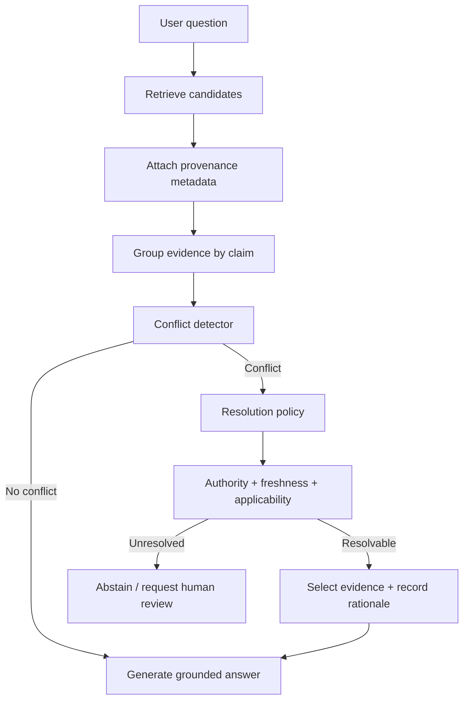

# Evidence Conflict Handling: When Retrieved Sources Disagree

## Why this matters
Yesterday's multi-hop retrieval loop answered: **Do I have enough evidence?** Today adds a harder question: **What if I have enough evidence, but the evidence disagrees?**

Enterprise knowledge is rarely perfectly consistent. A policy PDF may say one thing, a newer operating procedure another, and an old migration runbook something else. A relevance score tells you how closely a document matches the query; it does **not** tell you whether the document is authoritative, current, or applicable.

For an agent, this distinction is critical. The safe pattern is not "retrieve the top chunk and trust it." It is **retrieve → classify evidence → detect conflicts → resolve by explicit policy → answer or escalate**.

## Simple mental model: a compiler resolving symbols
Think of retrieved documents like candidate definitions of the same symbol. The agent should not randomly choose the definition that appeared first. It needs deterministic precedence rules.

For enterprise RAG, useful precedence dimensions are:
- **Authority:** Is this an approved policy, official specification, runbook, ticket, or informal note?
- **Freshness:** Which source is currently effective?
- **Applicability:** Does it apply to this product, jurisdiction, environment, customer, or software version?
- **Specificity:** Is a narrow rule intended to override a general rule?
- **Corroboration:** Do independent trusted sources agree?

The LLM can help *identify* a conflict, but your application should own the rules that decide what happens next.

## Core terms
- **Evidence conflict:** two or more retrieved sources make materially incompatible claims about the same fact or rule.
- **Provenance:** metadata describing where evidence came from and how it was produced.
- **Authority tier:** an enterprise-defined trust class such as approved policy > official runbook > wiki > ticket/comment.
- **Effective date:** when a document or rule becomes applicable; this is more useful than upload time.
- **Conflict policy:** deterministic rules for resolving or escalating contradictory evidence.
- **Abstention:** deliberately refusing to assert a conclusion when evidence cannot be resolved safely.

## Core components and request flow


A practical request flow is:
1. Retrieve a broader candidate set than the final context needs.
2. Preserve metadata such as source type, owner, approval state, effective date, version, jurisdiction, and URI.
3. Extract the material claims needed for the question.
4. Detect incompatible claims before answer generation.
5. Apply deterministic precedence rules where possible.
6. If the rules cannot resolve the conflict, abstain or route to a human.
7. Pass only the selected evidence plus conflict rationale into the final generation step.
8. Trace both selected and rejected evidence for auditability.

## Concrete example: migration automation
Assume a migration agent is converting a MuleSoft integration to Spring Boot. Retrieval returns three pieces of evidence:

- `architecture-standard-v5.pdf`: "New services must use Java 21." Approved, effective 2026-07-01.
- `payments-runbook.md`: "Build with Java 17." Approved, last reviewed 2025-11-10.
- `migration-notes.txt`: "We tested Java 21 successfully." Informal note.

Pure semantic ranking might put the runbook first because it closely matches the service name. That would be the wrong decision.

A policy-aware resolver can determine:
1. The architecture standard and runbook conflict on Java version.
2. Both are authoritative, but the architecture standard is newer and explicitly applies to *new services*.
3. The migration produces a new service, so Java 21 wins.
4. The informal note corroborates the decision but does not establish it.

The final answer should cite the architecture standard and optionally note that an older runbook still references Java 17. This also creates a useful governance signal: the runbook probably needs updating.

## Practical Python implementation
Start with explicit metadata and deterministic policy rather than an LLM-based "trust score."

```python
from dataclasses import dataclass
from datetime import date
from typing import Literal

Authority = Literal["policy", "standard", "runbook", "wiki", "informal"]

AUTHORITY_RANK = {
    "policy": 5,
    "standard": 5,
    "runbook": 4,
    "wiki": 2,
    "informal": 1,
}

@dataclass(frozen=True)
class Evidence:
    source_id: str
    claim: str
    value: str
    authority: Authority
    effective_date: date
    approved: bool
    applies_to: frozenset[str]


def applicable(e: Evidence, context: set[str]) -> bool:
    return e.applies_to.issubset(context)


def precedence(e: Evidence) -> tuple[int, int, date]:
    return (
        1 if e.approved else 0,
        AUTHORITY_RANK[e.authority],
        e.effective_date,
    )


def resolve(evidence: list[Evidence], context: set[str]):
    candidates = [e for e in evidence if applicable(e, context)]
    if not candidates:
        return {"status": "insufficient_evidence"}

    values = {e.value for e in candidates}
    if len(values) == 1:
        return {"status": "consistent", "selected": max(candidates, key=precedence)}

    ordered = sorted(candidates, key=precedence, reverse=True)
    best, runner_up = ordered[0], ordered[1]

    if precedence(best) > precedence(runner_up):
        return {
            "status": "resolved_conflict",
            "selected": best,
            "rejected": ordered[1:],
        }

    return {
        "status": "human_review",
        "candidates": ordered,
        "reason": "Conflicting evidence has equal policy precedence",
    }
```

This deliberately separates **retrieval relevance** from **decision precedence**. Retrieval finds potentially useful evidence; policy determines whether the system may trust one conflicting source over another.

For production, add a schema such as `document_type`, `approval_status`, `effective_from`, `effective_to`, `owner`, `version`, `jurisdiction`, `system`, and `supersedes_document_id`. Validate this metadata during ingestion rather than trying to infer all of it at query time.

### Where should the LLM participate?
Use the model for semantic work such as:
- extracting normalized claims from prose;
- deciding whether two passages actually contradict each other;
- explaining the conflict to a reviewer.

Keep deterministic code responsible for:
- authority hierarchy;
- date/version precedence;
- authorization and tenant boundaries;
- mandatory escalation conditions;
- final allow/abstain decisions for high-risk cases.

A useful structured output from the model is:

```python
from pydantic import BaseModel

class ClaimComparison(BaseModel):
    same_subject: bool
    contradictory: bool
    claim_a: str
    claim_b: str
    reason: str
```

Treat that output as an input to policy, not as the policy itself.

## Common mistakes and failure modes
1. **Using similarity score as trust.** High semantic relevance says nothing about authority or freshness.
2. **Using `last_modified` blindly.** A newly uploaded copy of an old policy is not necessarily newer policy. Prefer explicit effective dates and versions.
3. **Letting the LLM invent authority.** Authority should come from governed metadata wherever possible.
4. **Discarding losing evidence.** Keep rejected evidence and the resolution rationale in traces; it is valuable for audit and content cleanup.
5. **Always choosing the newest document.** A newer local note should not override an approved enterprise policy.
6. **Hiding unresolved conflict.** If equally authoritative sources disagree, confident generation is usually the wrong fallback.
7. **Resolving before applicability filtering.** A policy for Germany should not override an India-specific rule merely because it is newer.

## Enterprise use cases
- **Insurance claims:** policy wording, endorsements, claims manuals, and jurisdiction-specific procedures may disagree.
- **Software modernization:** current architecture standards can conflict with legacy application runbooks.
- **Operations:** incident procedures, product documentation, and historical tickets frequently contain stale instructions.
- **Regulatory knowledge:** effective dates and jurisdiction are as important as semantic relevance.
- **Customer support:** official product documentation should normally outrank forum posts and old case notes.

## Cloud implementation mapping
**AWS:** Amazon Bedrock Knowledge Bases supports metadata filtering and reranking. Use metadata such as effective dates and source classifications to constrain retrieval; keep enterprise authority/conflict policy in your application layer.

**Azure:** Azure AI Search can store filterable metadata alongside indexed content. Use filters for applicability and freshness, then implement authority precedence and conflict handling in the orchestration layer.

**GCP:** Vertex AI RAG Engine supports configurable retrieval and ranking. Preserve governed source metadata and perform conflict resolution before sending final context to Gemini or another generator.

The architectural principle is cloud-independent: **search systems rank relevance; your application owns epistemic policy.**

## Observability: trace the disagreement
A useful retrieval trace should record:

```text
question_id
retrieval_query
source_id
retrieval_score
authority_tier
approval_status
effective_date
applicability_result
normalized_claim
conflict_group_id
resolution_status
selected_or_rejected
resolution_rule
```

This turns a vague "RAG gave the wrong answer" incident into an inspectable decision. It also lets you measure a useful operational metric: **unresolved conflict rate by corpus**.

## 30–60 minute hands-on exercise
Build a small conflict resolver for a migration knowledge base.

1. Create 8–10 evidence records about Java versions, logging standards, API authentication, and deployment targets.
2. Intentionally create three conflicts: newer standard vs old runbook, approved policy vs informal note, and two equally authoritative documents.
3. Add metadata for authority, approval, effective date, and applicability.
4. Implement the deterministic resolver above.
5. Verify that the first two conflicts resolve automatically and the equal-precedence case escalates.
6. Add a trace record explaining why each source won or lost.

**Stretch goal:** ask an LLM to normalize free-text passages into `{claim, value}` structures, but keep the precedence algorithm deterministic.

## What to learn next
Next, move from conflict handling to **evidence provenance and citation architecture**: how to carry source identity through retrieval, reranking, tool calls, generation, and traces so every material claim can be audited back to its origin.

## Reading
1. [Amazon Bedrock — Configure and customize Knowledge Base queries](https://docs.aws.amazon.com/bedrock/latest/userguide/kb-test-config.html)
2. [Amazon Bedrock — Query a knowledge base and retrieve data](https://docs.aws.amazon.com/bedrock/latest/userguide/kb-test-retrieve.html)
3. [Amazon Bedrock — Reranking](https://docs.aws.amazon.com/bedrock/latest/userguide/rerank.html)
4. [Google Cloud — Vertex AI RAG Engine](https://cloud.google.com/blog/products/ai-machine-learning/introducing-vertex-ai-rag-engine)

---
**Architecture takeaway:** retrieval decides what is relevant; governed metadata and deterministic policy decide what is trustworthy enough to act on.