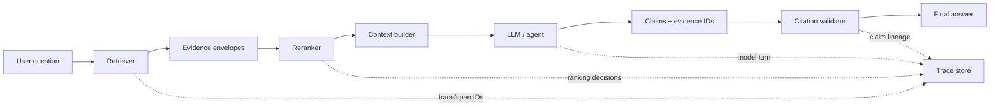

# Evidence Provenance: Keep Every AI Claim Auditable

## Why this matters
Yesterday's topic handled **conflicting evidence**. Today addresses the prerequisite that makes conflict handling, debugging, and audit possible: **provenance**.

A citation such as “Policy Manual, page 14” is useful to a reader, but an enterprise agent needs more. It should be able to answer: Which document version? Which chunk? Which retrieval query found it? Was it reranked? Which tool returned it? Which model turn consumed it? Which claims in the answer depend on it?

That chain is **evidence provenance**: durable identity and lineage for information as it moves through the agent.

## Simple mental model: distributed tracing for evidence
Software architects already know distributed tracing. A request receives a trace ID, each operation receives a span, and the IDs let us reconstruct what happened across services.

Use the same idea for RAG evidence:
- `trace_id` identifies the agent run.
- `evidence_id` identifies a specific retrieved evidence unit.
- `source_id` identifies the canonical source document or record.
- `source_version` identifies the version actually used.
- `claim_id` identifies an important generated claim.
- `claim_evidence` links each claim to one or more evidence IDs.

The key rule is simple: **never turn evidence into anonymous text** before the answer is complete.

## Core terms
- **Provenance:** information describing the origin and processing history of data.
- **Lineage:** the path data followed through transformations or system stages.
- **Evidence unit:** the smallest retrievable piece you want to cite and audit, commonly a chunk, record, API response, or code symbol.
- **Canonical source ID:** a stable identifier for the source independent of display name or URL changes.
- **Evidence envelope:** a structured object carrying evidence text together with identity and metadata.
- **Claim-evidence mapping:** an explicit relationship between an answer claim and the evidence supporting it.

## Core components and request flow


### Request flow
1. Assign the run a `trace_id`.
2. Retrieval returns structured evidence envelopes, not strings.
3. Reranking changes rank but preserves evidence IDs.
4. Context construction passes evidence IDs alongside text.
5. Generation returns structured claims referencing evidence IDs.
6. A deterministic validator rejects unknown or missing evidence references.
7. The renderer converts validated evidence IDs into user-facing citations.
8. Trace data records retrieval, tool, model, and validation operations.

## Concrete example: migration assistant
Suppose an agent is answering: **“Can this MuleSoft flow be migrated to Spring Boot without changing transaction semantics?”**

The agent retrieves a Mule configuration, an internal migration rule, and Spring transaction documentation. If these are flattened into one prompt string, the final answer may look plausible but you cannot reliably identify which source justified the transaction conclusion.

Instead, preserve an evidence envelope:

```python
from dataclasses import dataclass
from typing import Literal

@dataclass(frozen=True)
class Evidence:
    evidence_id: str
    source_id: str
    source_version: str
    locator: str
    text: str
    authority: Literal["primary", "approved_internal", "secondary"]
    retrieval_score: float

retrieved = [
    Evidence(
        evidence_id="ev_mule_17",
        source_id="repo:orders-api:src/main/mule/order.xml",
        source_version="git:8f31a2c",
        locator="flow:create-order/processors:3-7",
        text="Transactional scope ...",
        authority="primary",
        retrieval_score=0.91,
    )
]
```

Notice what is deliberately absent: a generated citation string. The UI citation is created later from trusted metadata; the model does not invent it.

### Make the model return evidence references
```python
from pydantic import BaseModel, Field

class Claim(BaseModel):
    text: str
    evidence_ids: list[str] = Field(min_length=1)

class Analysis(BaseModel):
    claims: list[Claim]
    conclusion: str


def validate_provenance(result: Analysis, evidence: list[Evidence]) -> None:
    valid_ids = {e.evidence_id for e in evidence}
    for claim in result.claims:
        unknown = set(claim.evidence_ids) - valid_ids
        if unknown:
            raise ValueError(f"Unknown evidence references: {unknown}")
```

For high-risk conclusions, add another deterministic rule: every material claim must reference at least one approved or primary evidence unit. An LLM-based groundedness evaluator can be added later, but identity validation should not require an LLM.

## Provenance versus citation
They are related but not identical.

| Concern | Citation | Provenance |
| --- | --- | --- |
| Primary consumer | Human reader | Application, auditor, evaluator |
| Main question | Where can I read this? | How did this evidence become this claim? |
| Typical data | Title, URL, page | Source/version/chunk IDs, retrieval/rerank/tool/trace lineage |
| When created | Usually answer rendering | At evidence acquisition and preserved throughout |

A good architecture derives citations **from provenance**, not provenance from citation text.

## Common mistakes and failure modes
- **Flattening documents into strings too early.** Identity disappears during prompt assembly.
- **Using URL as the only source ID.** URLs change and may not identify document versions.
- **Losing IDs during reranking.** Treat ranking as a transformation of evidence objects, not text.
- **Letting the model invent citations.** Only allow references to IDs supplied in context, then validate them.
- **Capturing provenance only in logs.** The application also needs claim-level relationships for validation and audit.
- **Logging sensitive evidence indiscriminately.** Trace metadata and content need separate retention and redaction policies.
- **Confusing retrieval score with trust.** Similarity, authority, freshness, and applicability are separate dimensions.

## Enterprise use cases
- **Migration automation:** trace generated code changes back to source integration constructs, migration rules, and target-framework documentation.
- **Insurance claims:** associate recommendations with policy clauses, claim records, and approved operating procedures.
- **Compliance assistants:** prove which effective regulation version supported a recommendation.
- **Coding assistants:** connect generated patches to repository files, symbols, tests, and architecture standards.
- **Incident agents:** retain lineage from alerts and telemetry through diagnosis and proposed remediation.

## Practical implementation guidance
Start with a small provenance contract shared across retrievers and tools. Do not begin with a large knowledge graph.

**At ingestion:** assign stable `source_id`, `source_version`, and locator metadata. For Git, commit SHA is a natural version. For policies, use controlled document/version IDs rather than filenames alone.

**At retrieval:** generate an immutable `evidence_id` for the returned unit. Keep retrieval query, strategy, score, and rank in trace/event metadata.

**At reranking:** preserve the same evidence IDs and record old/new rank. Never regenerate identity because ranking changed.

**At tool boundaries:** wrap API responses in the same evidence abstraction where they can support claims. Tool output is evidence too.

**At generation:** require structured output containing evidence IDs for material claims. Do not ask the model to manufacture URLs.

**At validation:** reject nonexistent evidence IDs and optionally require minimum authority classes for high-risk claims.

**At rendering:** resolve evidence IDs to human-readable citations from trusted metadata.

**At observability:** correlate evidence processing with agent traces. The OpenAI Agents SDK models a workflow as a trace composed of spans and records model generations, tool calls, guardrails, and handoffs. That is a useful execution-lineage layer; your application should add evidence identity and claim relationships as domain metadata.

### Java / Go notes
In Java, model `Evidence` as an immutable record and carry it through retrieval/reranking services rather than returning `List<String>`. In Go, use a value struct with explicit JSON fields and avoid passing raw `[]string` chunks between pipeline stages. In either language, put provenance types in a small shared contract package so adapters cannot silently discard metadata.

## Cloud mapping
Cloud services can store and retrieve metadata, but **the end-to-end provenance contract belongs to your application**. Search services on AWS, Azure, and GCP can preserve document metadata; tracing platforms can capture execution telemetry. Do not assume either layer automatically creates claim-level evidence lineage.

## 30–60 minute exercise
Take a simple RAG prototype that currently returns `list[str]` chunks.

1. Replace strings with an `Evidence` object containing `evidence_id`, `source_id`, `source_version`, `locator`, and `text`.
2. Add a fake reranker and prove that evidence IDs survive reordering.
3. Define a Pydantic `Claim` with `evidence_ids`.
4. Write a validator that rejects a hallucinated evidence ID such as `ev_999`.
5. Add `trace_id` and log retrieval → rerank → generation → validation events without logging the evidence text itself.

**Success criterion:** given any generated material claim, you can programmatically identify the exact source version and evidence unit that supported it.

## What to learn next
Next: **citation and groundedness validation** — checking not only that a cited evidence ID exists, but that the cited passage actually supports the generated claim. This introduces entailment-style checks, claim decomposition, and deterministic versus model-based validation.

## Reading
- [OpenAI Agents SDK — Tracing](https://openai.github.io/openai-agents-python/tracing/) — practical trace/span model for agent runs, model generations, tools, guardrails, and handoffs.
- [OpenTelemetry — GenAI Observability](https://opentelemetry.io/blog/2026/genai-observability/) — practical GenAI span trees and semantic-convention attributes.
- [OpenTelemetry — Semantic convention guidance](https://opentelemetry.io/docs/specs/semconv/how-to-write-conventions/) — useful design principles for operation names, attributes, sampling, and sensitive data.
- [OpenAI Agents SDK — Running agents](https://openai.github.io/openai-agents-python/running_agents/) — trace IDs, grouping, metadata, sensitive-data controls, and run configuration.
