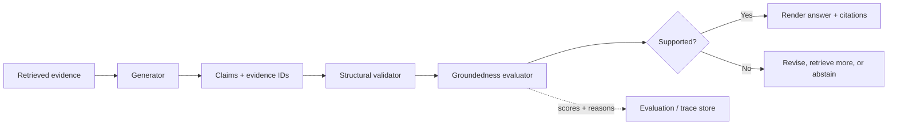

# Citation Groundedness Validation: Does the Evidence Actually Support the Claim?

## Why this matters
Yesterday we preserved **evidence provenance**: every important claim can be traced to the evidence that produced it. Today we add the next control: verify that the evidence **actually supports the claim**.

A response can contain a perfectly valid citation and still be wrong. The cited document may be relevant to the topic but not support the exact assertion. In enterprise systems, this distinction matters for policy answers, migration recommendations, claims decisions, compliance explanations, and generated code guidance.

The practical rule is: **citation existence is a structural check; groundedness is a semantic check. Treat them separately.**

## Simple mental model: a database foreign key plus a semantic constraint
Think of a generated claim as a row containing an `evidence_id`.

A database can verify that the referenced evidence exists — similar to a foreign key. But it cannot tell whether the evidence logically justifies the claim. That second question requires a semantic validator.

So use two gates:
1. **Structural citation validation:** Is every citation known, reachable, and attached to the correct source version?
2. **Claim groundedness validation:** Does that evidence support the meaning of the claim?

## Core terms
- **Claim:** a factual or decision-relevant assertion in the generated answer.
- **Citation:** a reference from a claim to a source or evidence unit.
- **Groundedness:** whether a generated assertion is supported by the supplied evidence rather than invented or extrapolated without support.
- **Entailment:** whether the evidence logically supports the claim.
- **Abstention:** deliberately refusing to make a claim when evidence is insufficient.
- **LLM-as-judge:** using a language model with a defined rubric to score another model's output.

## Core components and request flow


### Request flow
1. Retrieval produces evidence with stable IDs and source metadata.
2. Generation emits important claims plus the evidence IDs intended to support them.
3. A deterministic validator rejects missing, unknown, stale, or unauthorized evidence IDs.
4. A groundedness evaluator receives the **claim and only its cited evidence**.
5. The evaluator returns `supported`, `unsupported`, or preferably `insufficient`, with a reason.
6. Unsupported claims are removed, revised, sent through another retrieval step, or converted into an explicit uncertainty statement.
7. Store the validation result with the trace so failures can become future eval cases.

## Concrete example: validating a migration recommendation
Suppose a migration agent says:

> “This MuleSoft flow can be migrated to Spring Boot without changing transaction semantics.”

It cites an internal rule saying that JMS-to-JMS flows *may* preserve transaction boundaries when all participating connectors support the same transaction model. The citation exists, but that evidence does not prove that **this particular flow** satisfies the condition.

A validator should therefore distinguish `SUPPORTED` from `INSUFFICIENT` rather than treating topical similarity as proof.

```python
from dataclasses import dataclass
from enum import Enum

class Verdict(str, Enum):
    SUPPORTED = "supported"
    UNSUPPORTED = "unsupported"
    INSUFFICIENT = "insufficient"

@dataclass(frozen=True)
class Evidence:
    evidence_id: str
    text: str

@dataclass(frozen=True)
class Claim:
    claim_id: str
    text: str
    evidence_ids: tuple[str, ...]

def structural_check(claim: Claim, evidence_by_id: dict[str, Evidence]) -> None:
    if not claim.evidence_ids:
        raise ValueError(f"{claim.claim_id}: citation required")
    unknown = set(claim.evidence_ids) - evidence_by_id.keys()
    if unknown:
        raise ValueError(f"{claim.claim_id}: unknown evidence {unknown}")

def build_judge_input(claim: Claim, evidence_by_id: dict[str, Evidence]) -> dict:
    structural_check(claim, evidence_by_id)
    return {
        "claim": claim.text,
        "evidence": [evidence_by_id[eid].text for eid in claim.evidence_ids],
        "rubric": (
            "Return supported only when the evidence directly supports the claim. "
            "Return insufficient when required facts are absent. "
            "Return unsupported when evidence contradicts the claim."
        ),
    }
```

The important architecture choice is not the judge model. It is the **validation contract**: the judge sees one atomic claim, its exact evidence, and a narrow rubric.

## Why claim-level evaluation beats whole-answer scoring
A whole response might contain ten claims and five citations. A single groundedness score such as `4/5` is useful for aggregate evaluation, but poor as a runtime control: you do not know which claim failed.

For high-value workflows, decompose the answer into material claims and validate each claim separately. Use whole-response metrics for dashboards and regression testing; use claim-level verdicts for runtime decisions.

## Common mistakes and failure modes
- **Checking only that citations exist.** A real citation can still fail to support the claim.
- **Giving the judge the entire retrieval context.** The judge may find support in evidence the answer never cited, hiding broken claim-to-source lineage.
- **Using only binary pass/fail.** `Insufficient evidence` is operationally different from contradiction.
- **Validating every sentence.** This adds cost and noise. Focus on factual, financial, compliance, security, architectural, and decision-driving claims.
- **Letting the same prompt generate and self-certify the answer.** Separate generation from validation and evaluate the validator itself on labeled examples.
- **Treating judge scores as truth.** LLM judges are probabilistic; calibrate them against human-reviewed cases and deterministic checks.

## Enterprise use cases
- **Insurance claims:** verify that eligibility or exclusion statements are supported by the exact policy clauses in force for the claim.
- **Architecture assistants:** ensure technology recommendations cite standards that actually impose the stated constraint.
- **Migration automation:** validate claims about transaction semantics, retry behavior, security, and protocol compatibility before generating migration plans.
- **Operations:** require incident explanations to be supported by logs, traces, runbooks, or change records.
- **Compliance:** map generated conclusions to exact controls and evidence versions for later audit.

## Practical implementation guidance
Start with three layers rather than one large evaluator.

**Layer 1 — deterministic integrity checks**
- evidence ID exists;
- source version is known;
- user was authorized to retrieve it;
- citation locator resolves;
- evidence was actually present in the generation context.

**Layer 2 — semantic claim validation**
Use an LLM judge or managed groundedness evaluator for material claims. Require a structured verdict such as:

```json
{
  "verdict": "insufficient",
  "reason": "The rule is conditional and the evidence does not establish connector transaction compatibility."
}
```

**Layer 3 — policy action**
Do not merely log failures. Define what the application does:
- low risk → mark uncertainty;
- medium risk → retrieve additional evidence and retry once;
- high risk → abstain or require human approval.

For **Java**, model the verdict as a sealed type or enum and keep validation outside the LLM client adapter. For **Go**, use typed structs for `Claim`, `Evidence`, and `Verdict`; keep deterministic integrity checks synchronous before any judge call.

## Cloud mappings — only where they help
- **Azure:** Microsoft Foundry provides RAG evaluators for retrieval, groundedness, relevance, and response completeness. Its groundedness evaluator measures whether the response aligns with supplied context without fabrication.
- **AWS:** use Bedrock model/tool execution with application-level claim/evidence contracts; evaluate groundedness in your evaluation pipeline rather than assuming citations imply support.
- **GCP:** Vertex AI evaluation can be used as part of an offline quality pipeline; keep runtime claim-level integrity checks in the application so the same contract works across model providers.

The architecture should remain portable: cloud evaluators are useful implementations of a validation stage, not the definition of your evidence contract.

## 30–60 minute hands-on exercise
Take yesterday's provenance model and add a `Claim` object with `claim_id`, `text`, and `evidence_ids`.

Create six test cases:
1. directly supported claim;
2. citation exists but evidence is only topically related;
3. evidence contradicts the claim;
4. evidence is incomplete;
5. unknown evidence ID;
6. claim has no citation.

Implement deterministic checks for cases 5 and 6. Then write a strict judge prompt for cases 1–4 that returns only `supported`, `unsupported`, or `insufficient`. Review whether your rubric reliably distinguishes contradiction from missing evidence.

## What to learn next
Next: **groundedness eval design and judge calibration** — how to build a labeled test set, measure false-pass and false-fail rates, and decide whether an LLM judge is reliable enough to act as a runtime gate.

## Reading
- [Microsoft Foundry — RAG evaluators](https://learn.microsoft.com/en-us/azure/foundry/concepts/evaluation-evaluators/rag-evaluators)
- [Microsoft Foundry — Agent evaluators](https://learn.microsoft.com/en-us/azure/foundry/concepts/evaluation-evaluators/agent-evaluators)
- [Microsoft Foundry — Built-in evaluators](https://learn.microsoft.com/en-us/azure/foundry/concepts/built-in-evaluators)
- [Azure AI Content Safety — Groundedness detection](https://learn.microsoft.com/en-us/azure/foundry/openai/concepts/content-filter-groundedness)
