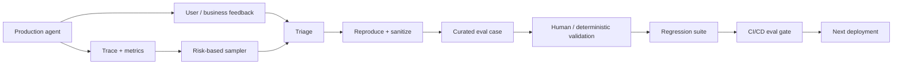

# Production Evaluation Feedback Loops: Turn Real Agent Failures into Better Evals

## Why this matters

Yesterday's release gate answers: **is this version safe enough to deploy against the failures we already know about?** Production asks a different question: **what failures did we not know to test?**

Agentic systems are especially exposed because users, retrieved documents, tools, external APIs, and multi-step trajectories create combinations that a static test suite cannot anticipate.

The goal is therefore not simply "monitor the model." Build a feedback loop:

**production signal → reproducible case → curated eval → regression gate → improved system**

Anthropic recommends combining automated evals with production monitoring, transcript review, user feedback, A/B testing, and periodic human calibration. OpenAI's agent tooling similarly treats traces as end-to-end records of model calls, tool calls, guardrails, and handoffs that can later be graded.

## Simple mental model: an SRE incident loop for AI behavior

Traditional SRE does not fix an outage and discard the evidence. A useful incident becomes a runbook, alert, test, or architectural control.

Treat an important agent failure the same way.

A bad production trace is **not automatically an eval**. It is raw incident evidence. First reproduce it, remove sensitive data, define expected behavior, and decide how to grade it. Only then promote it into the regression suite.

## Core terms

- **Production signal:** evidence from a live system, such as an error, bad rating, policy violation, unusual tool sequence, or expensive run.
- **Trace:** a structured record of one agent execution, including model and tool steps.
- **Triage:** deciding whether a signal represents a real product failure and how severe it is.
- **Eval case:** a repeatable task with explicit success criteria.
- **Regression suite:** eval cases that protect behavior already known to matter.
- **Distribution drift:** production inputs or behavior becoming meaningfully different from the data represented by existing evals.
- **Sampling:** selecting a manageable subset of production runs for inspection or automated grading.

## Core components and request flow



### Request flow

1. Instrument each agent run with a trace ID, agent version, prompt/config version, model, tools, latency, token usage, and outcome.
2. Capture explicit signals such as tool errors, policy blocks, human escalation, user corrections, and business outcome failures.
3. Sample additional successful and unsuccessful runs. Do not inspect only obvious failures.
4. Triage the sampled run: was the problem retrieval, planning, tool selection, tool execution, generation, policy, or infrastructure?
5. Reproduce the failure in an isolated environment.
6. Remove personal, confidential, and unstable production data.
7. Write an unambiguous task and expected outcome.
8. Choose the simplest trustworthy grader: deterministic first; rubric-based model judge only where semantics require it.
9. Validate the case manually.
10. Add it to the regression suite and let future releases prove they do not reintroduce it.

## Concrete example: a migration agent misses a transactional dependency

Imagine a migration assistant analyzing a MuleSoft flow. It generates valid Spring Boot code and all compilation checks pass. In production review, however, an architect notices that the source flow uses a JMS transaction spanning two operations and the generated implementation lost the atomic behavior.

The useful production artifact is not simply:

> "The generated migration was wrong."

Turn it into a reusable eval:

```yaml
id: preserve-jms-transaction-001
input_fixture: fixtures/jms_transaction_flow/
expected:
  transaction_boundary_preserved: true
  unsupported_semantics_must_be_reported: true
graders:
  - type: deterministic
    check: architecture.transaction_boundary
  - type: deterministic
    check: generated_tests.transaction_rollback
  - type: llm_rubric
    rubric: explains_transaction_risk
```

Now every prompt, model, harness, parser, or code-generation change can be tested against the same architectural requirement.

## Practical Python implementation

Keep production capture separate from eval promotion.

```python
from dataclasses import dataclass
from enum import Enum

class FailureType(str, Enum):
    RETRIEVAL = "retrieval"
    PLANNING = "planning"
    TOOL = "tool"
    GENERATION = "generation"
    POLICY = "policy"
    INFRASTRUCTURE = "infrastructure"

@dataclass(frozen=True)
class ProductionSignal:
    trace_id: str
    agent_version: str
    failure_type: FailureType
    severity: int
    reproducible: bool
    contains_sensitive_data: bool

def should_triage(signal: ProductionSignal) -> bool:
    return (
        signal.severity >= 4
        or signal.failure_type == FailureType.POLICY
        or signal.reproducible
    )

def eligible_for_eval(signal: ProductionSignal) -> bool:
    # Promotion still requires a human-defined expected outcome.
    return signal.reproducible and not signal.contains_sensitive_data

def promote_to_eval(signal: ProductionSignal, task: str, expected: dict) -> dict:
    if not eligible_for_eval(signal):
        raise ValueError("Signal must be reproducible and sanitized first")

    return {
        "source_trace": signal.trace_id,
        "agent_version": signal.agent_version,
        "task": task,
        "expected": expected,
        "provenance": "production_failure",
    }
```

In a real system, add a review workflow between `eligible_for_eval` and `promote_to_eval`. Production data should not silently become test data.

### Java and Go notes

In Java, model signals as immutable records and emit trace/metric events through OpenTelemetry. Keep eval fixtures in version control alongside deterministic validators.

In Go, use small typed structs for trace metadata and failure classification. A queue-based promotion pipeline works well: production services emit candidate signals; a separate eval service performs sanitization, reproduction, and curation.

## What should you monitor?

Do not create a dashboard containing only "LLM quality score."

Track several layers:

| Layer | Example signals |
|---|---|
| System | latency, timeouts, token usage, cost |
| Tools | error rate, wrong arguments, retries, denied calls |
| Retrieval | empty retrieval, low relevance, source freshness |
| Agent behavior | loops, excessive steps, unnecessary tool calls, handoff failures |
| Safety | guardrail triggers, approval bypass attempts |
| Outcome | task completion, correction rate, escalation rate |
| Human signal | thumbs-down, edited answer, rejected migration, reviewer override |

A trace explains **how** a run behaved. Business telemetry tells you whether the run was actually useful. You need both.

## Common mistakes and failure modes

**1. Turning every bad rating into an eval.** User dissatisfaction can reflect preference rather than correctness. Triage first.

**2. Sampling only failures.** You also need successful runs to detect false alarms and understand normal behavior.

**3. Copying production data directly into test fixtures.** This creates privacy, security, reproducibility, and retention problems. Sanitize and minimize.

**4. Using one LLM judge for everything.** Use deterministic checks for facts such as tool success, schema validity, compilation, authorization, and expected state changes.

**5. Monitoring averages only.** A 95% average can hide a catastrophic 0% success rate for one important workflow. Segment by task type, tenant, tool, agent version, and risk class.

**6. Fixing the prompt without creating a regression case.** The next prompt or model upgrade can silently restore the failure.

**7. Grading the exact trajectory when only the outcome matters.** Agents can find multiple valid paths. Constrain tool sequences only when the sequence itself is a requirement.

## Enterprise use cases

- **Migration automation:** rejected migrations become architecture-semantic regression fixtures.
- **Claims support:** incorrect policy interpretations become groundedness and citation cases.
- **Developer assistants:** reverted generated patches become coding eval candidates.
- **Service desk agents:** unnecessary escalations become routing and tool-selection cases.
- **Compliance assistants:** human overrides become high-priority policy evals.
- **RAG systems:** unanswered questions and incorrect citations feed retrieval and groundedness suites.

## Cloud mapping

Use cloud services when they fit the platform already hosting the workload rather than building a separate AI-specific monitoring island.

- **AWS:** CloudWatch / X-Ray or OpenTelemetry for operational telemetry; S3 and analytics services for curated evaluation datasets.
- **Azure:** Azure Monitor / Application Insights and OpenTelemetry for traces; Foundry evaluation capabilities where appropriate.
- **GCP:** Cloud Logging / Trace and OpenTelemetry; Vertex AI evaluation tooling for managed evaluation workflows.

Keep your **eval case format vendor-neutral**. Models and managed evaluation services will change faster than your enterprise acceptance criteria.

## 30–60 minute design exercise

Take one agentic workflow you understand well, preferably a code-migration or RAG workflow.

1. Define five production signals worth capturing.
2. Choose one high-impact failure.
3. Classify it as retrieval, planning, tool, generation, policy, or infrastructure.
4. Write a sanitized, reproducible eval task for it.
5. Define one deterministic grader and, only if necessary, one semantic grader.
6. Decide which CI gate should consume the resulting regression test.

The important output is the path from **incident to permanent test**, not a dashboard.

## What to learn next

Next, move from individual production failures to **trace-level observability for agents**: how to structure spans around model calls, retrieval, tools, guardrails, and handoffs so an architect can diagnose *where* a multi-step agent failed rather than merely knowing that it failed.

## Reading

1. Anthropic — [Demystifying evals for AI agents](https://www.anthropic.com/engineering/demystifying-evals-for-ai-agents)
2. OpenAI — [Evaluate agent workflows](https://developers.openai.com/api/docs/guides/agent-evals)
3. OpenAI — [Agent tracing](https://developers.openai.com/api/docs/guides/agents-api/tracing)
4. OpenAI — [Evaluation best practices](https://developers.openai.com/api/docs/guides/evaluation-best-practices)
5. Google Cloud — [Gemini Enterprise Agent Platform](https://cloud.google.com/products/gemini-enterprise-agent-platform)
