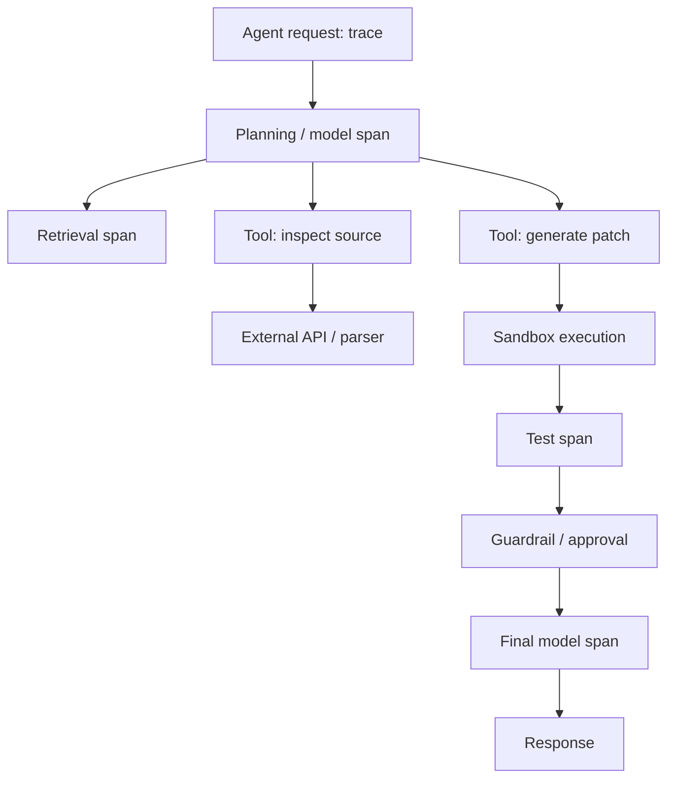

# Trace-Level Agent Observability: Debug the Step, Not Just the Outcome

## Why this matters

Yesterday we built the feedback loop from production failures into regression evals. Today we move one layer deeper: **how do you know where an agent run failed?**

A normal API metric can tell you that a request took 12 seconds and returned an error. That is not enough for an agent. During those 12 seconds the agent may have retrieved documents, called an LLM three times, invoked two tools, retried one tool, hit a guardrail, and handed work to another agent.

Agent observability makes that internal execution path visible.

The OpenAI Agents SDK traces model generations, function tools, guardrails and handoffs. OpenTelemetry provides the broader distributed-tracing model, while AWS and Google Cloud now expose agent-oriented trace views as well.

## Simple mental model: distributed tracing for a reasoning workflow

You already know distributed tracing from microservices.

A **trace** represents one end-to-end request. A **span** represents one timed operation inside it. Parent-child relationships reconstruct the execution path.

For agents, replace microservice hops with **reasoning and action hops**:

- model turn
- retrieval
- tool invocation
- guardrail
- handoff
- approval
- external API/database call

The important shift is this:

> Do not log only what the agent answered. Record how it arrived there.

## Core terms

- **Trace:** the complete execution record for one logical agent request.
- **Span:** one operation with start/end time and metadata.
- **Parent span:** the operation that caused another span.
- **Trace context:** identifiers propagated across components so their spans belong to the same trace.
- **Attribute:** structured metadata such as model, tool name, token count, or outcome.
- **Event:** a notable point inside a span, such as a retry or approval request.
- **Trajectory:** the sequence of decisions and actions taken by an agent.
- **Correlation ID:** an application identifier used to connect telemetry with a business request or session.

## Core components and request flow



A useful trace preserves the hierarchy. If `generate patch` takes eight seconds, you should be able to open that span and see whether the time was model latency, sandbox startup, filesystem I/O, or tests.

## What should become a span?

A practical rule: create a span when an operation is **independently useful for debugging, measuring, or policy enforcement**.

Good span boundaries include:

| Span | Useful attributes |
|---|---|
| agent.run | agent/version, task type, outcome |
| model.generate | model, tokens, latency, finish reason |
| retrieval.search | index, query type, result count |
| tool.call | tool, arguments hash, outcome, retries |
| sandbox.execute | image/version, timeout, exit code |
| guardrail.check | policy/version, pass/block |
| handoff | source agent, target agent, reason |
| approval | policy, decision, approver type |

Avoid creating spans for every internal helper function. Telemetry should explain architecture, not reproduce the call stack.

## Concrete example: migration agent generates a bad implementation

Suppose a migration agent converts a MuleSoft integration into Spring Boot. The final Java compiles, but the generated implementation misses a transaction boundary.

A top-level log might say:

```text
migration completed: success
duration: 21.4s
```

The trace tells a different story:

```text
migration.run                         21.4s
 ├─ discover.source                   2.1s
 ├─ retrieve.migration_rules          0.8s
 ├─ model.plan                        3.4s
 ├─ tool.extract_semantics            1.7s
 │   └─ parser.mule_xml               1.5s
 ├─ model.generate_code               7.9s
 ├─ sandbox.tests                     4.2s
 └─ guardrail.semantic_parity         0.6s   PASS
```

Now the important question becomes visible: **why did semantic parity pass when the transaction boundary was absent?**

The defect may be in the evaluator or extracted canonical semantics rather than the code generator. Without the trajectory, teams often change the prompt of the wrong component.

## Practical Python implementation

Start with OpenTelemetry so your application-level trace model is not tied to one agent framework.

```python
from opentelemetry import trace
from opentelemetry.trace import Status, StatusCode

tracer = trace.get_tracer("migration-agent")

def run_migration(request):
    with tracer.start_as_current_span("migration.run") as root:
        root.set_attribute("agent.name", "mule-migration")
        root.set_attribute("agent.version", "1.8.0")
        root.set_attribute("migration.flow_id", request.flow_id)

        with tracer.start_as_current_span("retrieval.search") as span:
            span.set_attribute("retrieval.strategy", "hybrid")
            rules = retrieve_rules(request)
            span.set_attribute("retrieval.result_count", len(rules))

        with tracer.start_as_current_span("tool.extract_semantics") as span:
            canonical = extract_semantics(request.source)
            span.set_attribute(
                "migration.transaction_detected",
                canonical.has_transaction
            )

        try:
            with tracer.start_as_current_span("sandbox.tests") as span:
                result = run_tests(canonical)
                span.set_attribute("test.total", result.total)
                span.set_attribute("test.failed", result.failed)

                if result.failed:
                    span.set_status(Status(StatusCode.ERROR))
        except Exception as exc:
            root.record_exception(exc)
            root.set_status(Status(StatusCode.ERROR))
            raise

        return build_result(canonical)
```

In production, configure an OTLP exporter or your cloud's OpenTelemetry distribution rather than constructing a bespoke trace store.

### Java and Go notes

**Java:** use the OpenTelemetry Java agent for automatic HTTP/database instrumentation, then add manual spans around agent concepts such as retrieval, tool execution, sandboxing, approvals, and evals.

**Go:** propagate `context.Context` through the agent loop and tools. Start child spans from that context so tool and downstream service spans remain attached to the originating agent trace.

## Logs, metrics and traces are complementary

Do not replace all telemetry with traces.

- **Metrics** answer: *Is something getting worse?* Example: tool failure rate increased from 1% to 8%.
- **Logs** answer: *What discrete event occurred?* Example: sandbox exited with code 137.
- **Traces** answer: *Where in this particular execution did it happen, and what caused it?*

A useful production pattern is: alert from a metric → open an exemplar trace → inspect relevant spans → query correlated logs.

## Privacy and security

Agent traces can accidentally become a second data lake containing prompts, documents, tool arguments, credentials, source code, or personal information.

Prefer metadata by default:

```python
span.set_attribute("tool.name", "customer_lookup")
span.set_attribute("tool.result_count", 3)
span.set_attribute("tool.status", "success")
```

Do not automatically record:

```python
span.set_attribute("tool.arguments", raw_customer_record)
```

Capture full prompts or tool payloads only under an explicit retention, redaction, access-control, and sampling policy. OpenTelemetry guidance also recommends recording only attributes that provide clear operational value.

## Common mistakes and failure modes

**1. One span for the whole agent.** You know the run failed but still cannot identify the failing stage.

**2. Logging everything.** Full prompts, retrieved documents and tool payloads create cost, privacy and security problems.

**3. No version attributes.** Always capture model, prompt/config, agent, tool and policy versions needed to compare releases.

**4. Breaking trace propagation at tools.** A remote tool without trace context appears as an unrelated request.

**5. Measuring latency but not outcome.** Fast wrong answers are not healthy agent executions. Add outcome/eval metadata.

**6. Treating reasoning text as observability.** Hidden chain-of-thought is neither required nor appropriate. Observe externally meaningful operations, decisions, inputs/outputs allowed by policy, and outcomes.

**7. No business correlation.** A technically successful trace may correspond to a rejected claim, failed migration, or abandoned support session. Connect traces to business outcomes using safe identifiers.

## Enterprise use cases

- **Migration automation:** identify whether parity failures originate in discovery, semantic extraction, planning, generation, sandbox tests, or review.
- **Agentic RAG:** separate query rewriting, retrieval, reranking, evidence validation, and generation.
- **Coding assistants:** trace repository search, patch generation, sandbox execution, tests, and approval.
- **Claims agents:** audit retrieval, policy checks, tool actions, approvals, and human handoffs.
- **Service agents:** diagnose loops, unnecessary tool calls, repeated retrieval, and expensive handoffs.

## Cloud mappings

Use the platform's native observability when it fits your estate, while keeping OpenTelemetry as the conceptual interoperability layer.

- **AWS:** Bedrock AgentCore Observability integrates agent traces with CloudWatch; AWS documents OpenTelemetry instrumentation for model calls, tools and related requests.
- **Azure:** use Azure Monitor/Application Insights with OpenTelemetry and add agent-specific custom spans where framework instrumentation is insufficient.
- **GCP:** Gemini Enterprise Agent Platform exposes agent traces as a step-by-step execution DAG; OpenTelemetry remains useful for correlating agent work with surrounding services.

## Architecture guidance

For an enterprise agent platform, standardize a small span taxonomy rather than letting every team invent names.

For example:

```text
agent.run
agent.turn
model.generate
retrieval.search
retrieval.rerank
tool.call
sandbox.execute
guardrail.check
approval.wait
agent.handoff
eval.grade
```

Then define mandatory attributes per span type. This makes dashboards, SLOs and cross-team debugging reusable.

Also separate **telemetry schema** from **framework implementation**. LangGraph, Semantic Kernel, Google ADK or a custom loop may emit events differently; your observability contract should remain stable.

## 30–60 minute exercise

Instrument one small agent or scripted tool-calling loop.

1. Create a root `agent.run` span.
2. Add child spans for one model call, one retrieval/tool call, and one validation step.
3. Record duration, success/failure, model/tool name and token/result counts.
4. Deliberately make the tool fail once.
5. Inspect the trace and verify that you can answer:
   - Which step failed?
   - How much time was spent before failure?
   - Was it retried?
   - Which agent/tool version ran?
6. Remove raw prompts/tool payloads and confirm the trace is still operationally useful.

If the trace cannot answer those questions, improve the span model rather than adding arbitrary logs.

## What to learn next

Next: **agent SLOs and operational metrics** — turning traces into measurable reliability objectives such as task success, tool-error rate, loop rate, latency, token cost, and human-escalation rate.

## Reading

1. [OpenAI Agents SDK — Tracing](https://openai.github.io/openai-agents-python/tracing/)
2. [OpenTelemetry — Trace semantic conventions](https://opentelemetry.io/docs/specs/semconv/general/trace/)
3. [AWS — AgentCore Observability](https://docs.aws.amazon.com/bedrock-agentcore/latest/devguide/observability-get-started.html)
4. [Google Cloud — View agent traces](https://docs.cloud.google.com/gemini-enterprise-agent-platform/optimize/observability/traces)
