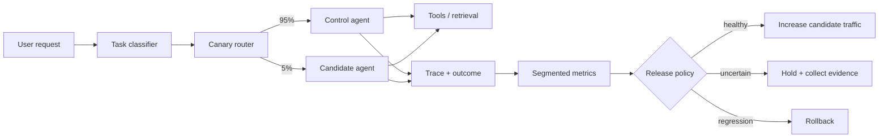

# Agent Release Canaries: Safely Roll Out Prompt, Model, and Tool Changes

## Why this matters
An agent can pass an offline evaluation and still fail after release. Production traffic is messier: requests are longer, tools are slower, data changes, and users combine capabilities in ways your test set did not predict.
A **release canary** is a controlled rollout in which a small fraction of real traffic uses a candidate agent configuration while most traffic continues to use the current configuration. The candidate might change the model, system prompt, retrieval strategy, tool definitions, memory policy, or harness logic.
The important idea is simple: **do not ask whether the new agent is better in aggregate; ask whether it is better enough, for the same kinds of tasks, without creating unacceptable regressions.**
## Mental model: two checkout lanes
Imagine a supermarket testing a new checkout process. You do not replace every checkout lane on Monday morning. You open one new lane, route a small but representative fraction of customers to it, and compare outcomes with the existing lanes.
For agents:
- **Control** = the currently deployed configuration.
- **Candidate** = the new configuration.
- **Canary traffic** = a small percentage routed to the candidate.
- **SLI** = Service Level Indicator, a measured signal such as task success or P95 latency.
- **SLO** = Service Level Objective, the target for an SLI.
- **Guardrail metric** = a metric that must not regress beyond a defined limit, even if other metrics improve.
- **Rollback** = returning traffic to the control when the candidate violates policy.
A canary is therefore not merely “send 5% traffic to the new model.” It is a **controlled experiment with explicit promotion and rollback rules**.
## Core components and request flow
A practical agent canary needs six pieces:
1. **Versioned configuration** — identify model, prompt, retrieval, tools, policies, and harness version.
2. **Traffic router** — deterministically assigns eligible requests to control or candidate.
3. **Telemetry** — records task class, version, latency, tool errors, cost, safety events, and outcome.
4. **Outcome evaluator** — determines whether the task actually succeeded.
5. **Segmented comparison** — compares candidate and control for equivalent task classes.
6. **Promotion policy** — promotes, holds, or rolls back based on predefined thresholds.

### Request flow
First classify the request into a stable task category. Then route an eligible subset to the candidate. Execute both versions with the same production controls. Record the version and task class on every trace. Evaluate outcomes using deterministic checks where possible and calibrated graders where necessary. Finally, compare the candidate against the control within each segment rather than relying only on global averages.
## Concrete example: canarying a migration agent
Assume a migration agent converts MuleSoft integration flows into Spring Boot services. You have changed the planning prompt and want to deploy it.
The old agent is `migration-v17`; the candidate is `migration-v18`.
Useful task segments might be:
- simple HTTP proxy
- transformation-heavy flow
- Salesforce integration
- JMS/Kafka flow
- orchestration with error handling
The candidate may improve ordinary HTTP migrations while damaging JMS error semantics. A global success rate can hide that regression.
Define metrics before rollout:
<table header-row="true">
<tr>
<td>Metric</td>
<td>Promotion rule</td>
</tr>
<tr>
<td>Semantic parity</td>
<td>candidate \>= control - 1 percentage point</td>
</tr>
<tr>
<td>Critical contract violations</td>
<td>zero</td>
</tr>
<tr>
<td>P95 latency</td>
<td>no more than 15% worse</td>
</tr>
<tr>
<td>Cost per successful migration</td>
<td>no more than 10% worse</td>
</tr>
<tr>
<td>Human escalation rate</td>
<td>no more than 2 points worse</td>
</tr>
<tr>
<td>Loop / max-step termination</td>
<td>no material regression</td>
</tr>
</table>
The exact numbers are business decisions, not universal AI thresholds.
## Python implementation
Keep routing deterministic so the same request does not randomly move between versions during retries.
```python
from dataclasses import dataclass
import hashlib

@dataclass(frozen=True)
class Release:
    control: str = "migration-v17"
    candidate: str = "migration-v18"
    canary_percent: int = 5

def choose_version(request_id: str, release: Release) -> str:
    bucket = int(
        hashlib.sha256(request_id.encode()).hexdigest()[:8], 16
    ) % 100

    return (
        release.candidate
        if bucket < release.canary_percent
        else release.control
    )
```
Now attach the release identity to telemetry.
```python
def run_agent(request, release):
    version = choose_version(request.id, release)

    with tracer.start_as_current_span("agent.run") as span:
        span.set_attribute("agent.version", version)
        span.set_attribute("agent.task_class", request.task_class)

        result = execute_agent(
            request=request,
            config=load_version(version)
        )

        outcome = evaluate_outcome(request, result)

        span.set_attribute("agent.task_success", outcome.success)
        span.set_attribute("agent.tool_errors", result.tool_errors)
        span.set_attribute("agent.total_tokens", result.total_tokens)
        span.set_attribute("agent.cost_usd", result.cost_usd)

        return result
```
A minimal promotion function should keep **hard invariants** separate from softer quality metrics.
```python
def release_decision(control, candidate):
    if candidate.critical_policy_violations > 0:
        return "ROLLBACK"

    if candidate.success_rate < control.success_rate - 0.01:
        return "ROLLBACK"

    if candidate.p95_latency > control.p95_latency * 1.15:
        return "HOLD"

    if candidate.sample_size < 200:
        return "HOLD"

    return "PROMOTE"
```
In production, calculate confidence intervals and use minimum sample sizes per important segment. The code above illustrates the architecture, not a statistical test.
### Java and Go notes
In Java, implement routing as a stateless Spring component and put `agent.version` and `agent.task_class` into OpenTelemetry span attributes. Keep release policy outside the agent itself.
In Go, the same router can sit in middleware before the agent handler. Hash a stable request or tenant key, then attach version labels to OpenTelemetry spans and metrics.
## Shadow testing versus canary testing
These approaches solve different problems.
**Shadow testing** sends a copy of production input to the candidate but does not let the candidate affect the user or external state. It is safer and useful before a canary, especially for retrieval or read-only agents.
**Canary testing** lets the candidate serve real traffic. It measures realistic user outcomes, but it carries production risk.
For agents with write-capable tools, a useful progression is:
**offline eval → shadow traffic → read-only canary → constrained write canary → broader rollout**
Do not shadow a write-capable agent by simply duplicating tool calls. Replace state-changing tools with simulations, read-only equivalents, or sandboxed fixtures.
## Common mistakes and failure modes
**1. Random routing without stable assignment.** Retries may hit different agent versions, making debugging and comparison unreliable.
**2. Comparing aggregate metrics only.** Easy high-volume tasks can hide severe regressions in low-volume, high-value workflows.
**3. Changing multiple dimensions without recording them.** If model, prompt, retriever, and tool schema all change, you need a versioned release manifest to know what actually ran.
**4. Treating latency and cost as secondary.** A candidate with slightly higher quality but twice the latency or cost may be operationally worse.
**5. Letting the agent decide whether it should be rolled back.** Release control belongs in deterministic platform logic.
**6. Canarying irreversible actions too early.** Payments, policy updates, destructive infrastructure changes, and customer communications require stronger controls, approvals, or shadow simulation first.
**7. No minimum evidence rule.** A candidate that succeeds on 18 of 20 requests has not necessarily proven superiority over a mature control.
## Enterprise use cases
Release canaries are especially useful for:
- **Code migration agents:** compare semantic parity, compilation success, test pass rate, review effort, and cost.
- **Claims assistants:** compare evidence completeness, policy-groundedness, escalation rate, and prohibited-action rate.
- **Coding assistants:** compare accepted changes, test pass rate, rollback/revert rate, latency, and token cost.
- **RAG agents:** canary a new embedding model, reranker, query planner, or retrieval policy.
- **Service-desk agents:** compare resolution rate while protecting against unauthorized account or entitlement changes.
For high-risk workflows, segment not only by task but also by **action risk**: read-only, reversible write, consequential write.
## Practical architecture guidance
Treat an agent release as an immutable manifest:
```yaml
release: migration-v18
model: model-family-x
prompt: planner-2026-10-01
retriever: hybrid-v4
toolset: migration-tools-v7
guardrails: enterprise-policy-v5
harness: loop-v12
eval_suite: migration-regression-v9
```
This makes traces reproducible and gives you a meaningful rollback target.
Start with a small number of metrics. A useful initial set is:
- task success
- critical policy violations
- P95 end-to-end latency
- tool failure rate
- cost per successful task
- human escalation rate
Then segment them by task class. Avoid creating dozens of dashboards before you know which metrics drive decisions.
### Cloud mapping
The agent framework is less important than the separation of responsibilities.
- **AWS:** use your agent runtime or Bedrock/AgentCore components with CloudWatch and OpenTelemetry-compatible telemetry; keep routing and promotion policy in your application or deployment layer.
- **Azure:** use Azure AI/agent services with Azure Monitor/Application Insights for release-labelled traces and metrics.
- **GCP:** use Vertex AI/agent components with Cloud Monitoring and Cloud Trace; route candidate traffic at the application or serving layer.
The portable design is **version labels + OpenTelemetry + external release policy**.
## 30–60 minute hands-on exercise
Take one agent workflow you already understand and design a canary release for a single change—for example, a new system prompt.
Create:
1. a control and candidate version;
2. three meaningful task segments;
3. five metrics;
4. one hard rollback condition;
5. one HOLD condition for insufficient evidence;
6. a staged traffic plan such as 1% → 5% → 20% → 50% → 100%.
Then answer one architecture question: **which tool calls must be simulated or approval-gated before this candidate is allowed to receive real production traffic?**
If you have another 15 minutes, implement the deterministic Python router above and emit `agent.version` into a trace.
## What to learn next
Next, connect canary releases to **agent configuration versioning and reproducibility**: how to version prompts, models, tool schemas, retrieval settings, policies, skills, and harness code so a bad production trace can be replayed against the exact configuration that produced it.
## Reading
1. [OpenAI — Evaluate agent workflows](https://developers.openai.com/api/docs/guides/agent-evals)
2. [Anthropic — Demystifying evals for AI agents](https://www.anthropic.com/engineering/demystifying-evals-for-ai-agents)
3. [OpenAI — Predicting model behavior before release by simulating deployment](https://openai.com/index/deployment-simulation/)
4. [OpenAI — ChatGPT agent: user confirmations](https://deploymentsafety.openai.com/chatgpt-agent/user-confirmations)
---
**Architect takeaway:** treat an agent change like a production software release, but evaluate it on **behavior**, not merely uptime. Offline evals tell you whether a candidate deserves production exposure; a canary tells you whether it deserves more of it.